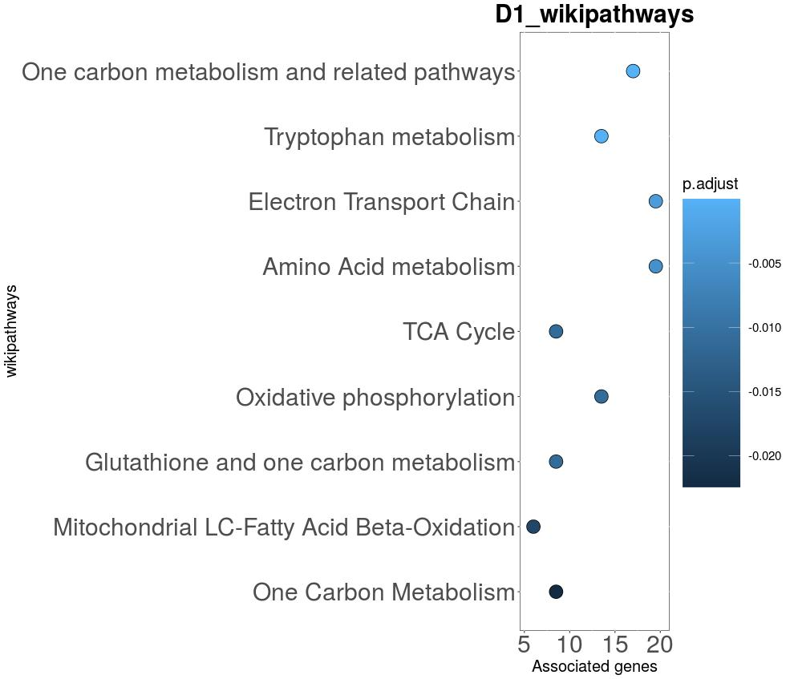
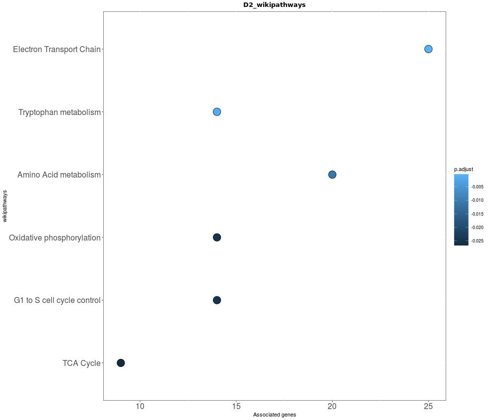
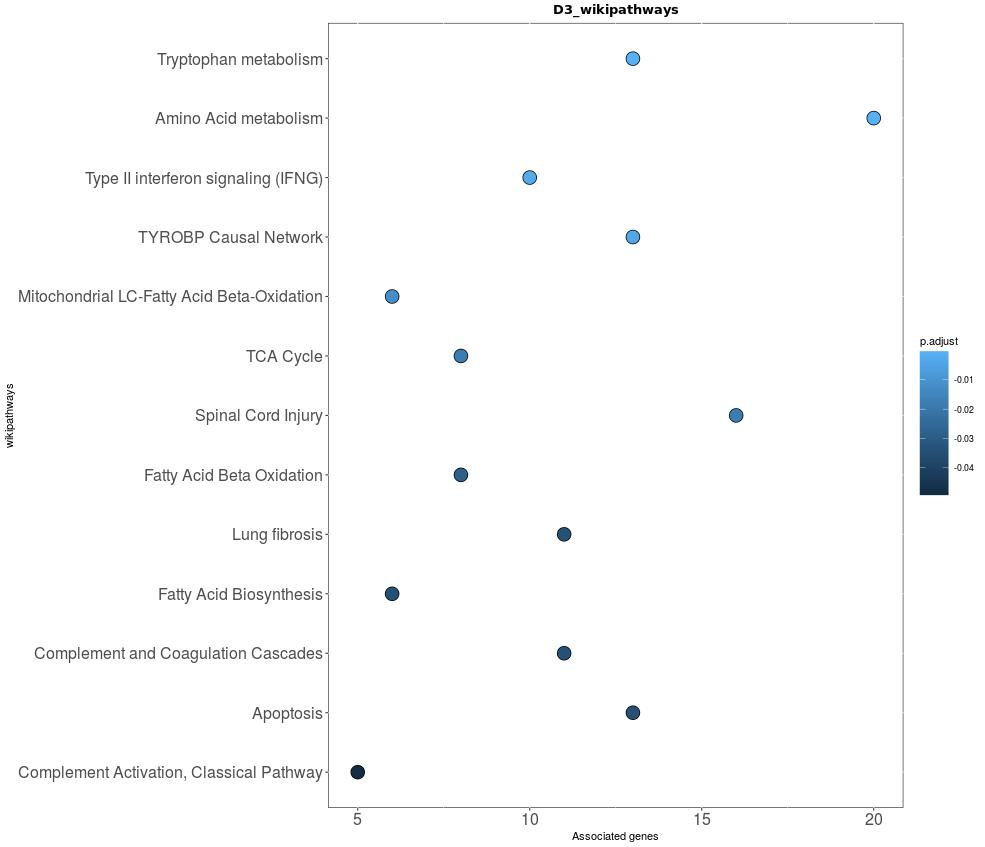
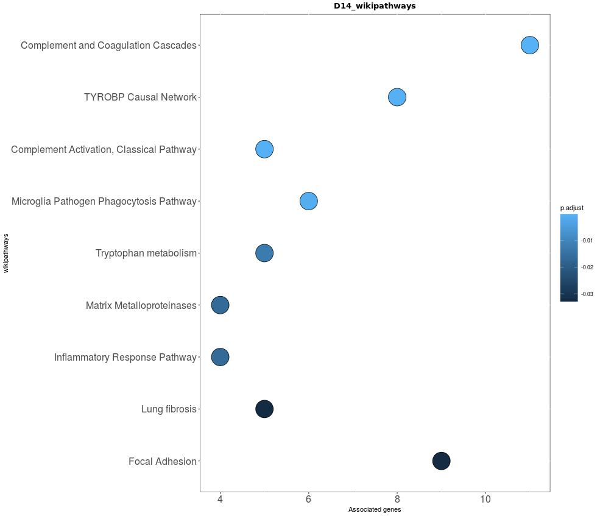
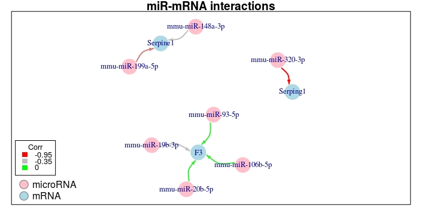
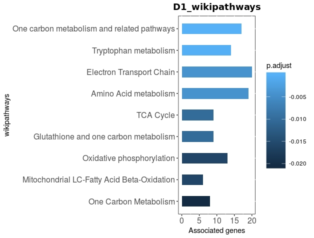

```{r setup, include=FALSE, results='asis', warning=FALSE}
knitr::opts_chunk$set(echo = TRUE, tidy = TRUE, warning = FALSE,
message = FALSE)
options(width = 800)
```


#: Introduction
Time incorporated microRNA Generation of Networks (TimiRGeN) is aimed at
researchers who wish to explore time series microRNA-mRNA expression data.
This package integrates, functionally analyses and generates small networks
for hypothesis generation.

To achieve data reduction without reducing biological signal, the TimiRGeN
package utilises several published packages and employs their functions
in a synergistic fashion for time series multi-omic analysis. The following
packages have been built upon for several functions in the TimiRGeN package:

[rWikiPathways](rWikipathway_path) [1],
[clusterProfiler](clusterProfiler_path) [2],
[DOSE](https://bioconductor.org/packages/release/bioc/html/DOSE.html) [3],
[biomaRt](https://bioconductor.org/packages/release/bioc/html/biomaRt.html) [4],
[RCy3](https://bioconductor.org/packages/release/bioc/html/RCy3.html) [5],
[Mfuzz](https://www.bioconductor.org/packages/release/bioc/html/Mfuzz.html) [6],
[igraph](https://igraph.org/redirect.html) [7].

TimiRGeN is very selective and only get miR-mRNA interaction data from
databases curated within the last 4 years. TimiRGeN also only uses  predictive databases
which use seed site specificity.

[TargetScans](http://www.targetscan.org/vert_72/)[8].
[miRDB](http://www.mirdb.org/)[9].
[miRTarBase](http://mirtarbase.mbc.nctu.edu.tw/php/index.php)[10].

TimiRGeN does have some capability to generate networks in R, however
this package is uniquely open ended, as the output can be easily be
exported to [Cytoscape](https://cytoscape.org/) [11] and
[Pathvisio](https://pathvisio.github.io/) [12] for better visualisation
options.

TimiRGeN solely uses wikipathways for functional pathway analysis,
and is the first tool to allow this for time series data. Wikipathways is a
user curated pathway database that contains 1000s of mechanistic
signalling pathways from multiple species [13]. 
Furthermore, wikipathways works very well with Pathvisio which is our recommended tool for GRN design.

The TimiRGeN package gives the user several options for their analysis.
Currently the package can analyse human or mouse data, perform analysis of miR and mRNA data combined or separately, and can use entrez or ensembl gene IDs. This tool can be best used after differential expression analysis.

#: Install TimiRGeN
```{r Install, eval=FALSE, message=FALSE, warning=FALSE}
if (!requireNamespace("BiocManager", quietly = TRUE))
install.packages("BiocManager")
BiocManager::install("TimiRGeN")
```


###: Load Libraries

```{r Load libs, echo=TRUE, message=FALSE, results='hide'}
library(TimiRGeN)
library(org.Mm.eg.db)
```

The following dependencies can be investigated further from these sources
[1-7, 14-23]

```{r, echo=FALSE, warning=FALSE, error=FALSE}
library(knitr)
library(kableExtra)
```


#: Time Series miR-mRNA Combined Analaysis on Mouse data using Entrez Gene IDs
### Example Mouse Kidney Fribrosis Dataset
In this section the combined method will be used to analyse a mouse kidney
fibrosis data set. The mRNA data from
[Craciun et al (2016)](https://www.ncbi.nlm.nih.gov/pmc/articles/PMC4884105/)
[24] which was downloaded from
[GSE65267](https://www.ncbi.nlm.nih.gov/geo/query/acc.cgi?acc=GSE65267). The
associated miR data was published in
[Pellegrini et al (2016)](https://www.ncbi.nlm.nih.gov/pmc/articles/PMC4912473/)
[25]
and was downloaded from
[GSE61328](https://www.ncbi.nlm.nih.gov/geo/query/acc.cgi?acc=GSE61328).

```{r Load Fibrosis data}
miR <- mm_miR

mRNA <- mm_mRNA
```

Notice the standard nomenclature used in the column names. Do follow the this
standard for your own input data. The time point should come
first and is followed by a '.'. After the '.' the column name should continue
to display the specific result types from differential expression analysis.

Note. There should only be one '.'  in each column name and no '_' characters.
Having more than one '.' any '_' characters will confuse some functions.

Note. There should be no NAs in your miR and mRNA data files.

### Create MultiAssayExperiment object

```{r MAE, message=FALSE}
MAE <- startObject(miR, mRNA)
```

TimiRGeN uses `MultiAssayExperiment` (MAE) to contain all the data.
The data frames, matrices and other S4 objects are stored in `Experiments`,
and the lists will be stored in the `metadata`.

### Retreive Gene IDs

```{r retrieveID data for miR data, warning=FALSE, message=FALSE}
MAE <- getIdsMirMouse(MAE = MAE, assay(MAE, 1))

MAE <- getIdsMrnaMouse(MAE = MAE, assay(MAE, 2))
```

Using `getIds` functions the entrez gene and ensembl annotation data for genes can be retrieved for downstream analysis.

Many wikipathways use either entrezgene IDs or ensembl gene IDs for annotation. Having both formats available can be useful. Also, due to the nature of miRs, many NAs may be found in the output. Entrez gene IDs and ensemble gene IDs are insensitive to miRs with -3p and -5p strands. Therefore, adjusted entrez gene IDs and ensemble gene IDs are also created.

### Filter Out Non-significant Genes

```{r combineGenes, error=FALSE, warning=FALSE}
MAE <- combineGenes(MAE = MAE, miR_data = assay(MAE, 1),
                    assay(MAE, 2))

MAE <- genesList(MAE = MAE, method = 'c',
                 genetic_data = assay(MAE, 9),
                 timeString = "D")

MAE <- significantVals(MAE = MAE, method = 'c',
                       geneList =metadata(MAE)[[1]],
                       maxVal = 0.05, stringVal = "adjPVal")
```

mRNA and miR data can be combined using `combineGenes` function.

The `genesList` function will transform the large data frame into multiple
nested data frames within a list. The data will be separated by the `timeString` parameter.
In this example by 'D' (days), because it was before the '.' in the column names.

Significant genes can be retrieved from each nested data frame using the
`significantVals` function. Here only genes which had an adjusted P value of
less than 0.05 will remain in the list.

#### Find Significant Gene IDs

```{r addentrezIDs, warning=FALSE, error=FALSE}
MAE <- addIds(MAE = MAE, method = 'c',
              filtered_genelist = metadata(MAE)[[2]],
              miR_IDs = assay(MAE, 3),
              mRNA_IDs = assay(MAE, 7))

MAE <- eNames(MAE = MAE, method = 'c',
              gene_IDs = metadata(MAE)[[3]],
              ID_Column = 4)
```

Now entrez IDs or ensembl IDs which were created before can be integrated
into our filtered data frames of genes using `addIds`. For this example entrez
gene IDs were be added.

Lists of entrezIDs/ ensembl IDs can be extracted for further analysis using
`eNames` function.

### Time Dependent Pathway Enrichment Method

Once we have a list of significant genes per time point we can put this through gene set enrichment to find novel pathways which this data is associate with.
To do this TimiRGeN uses wikipathways [13].

```{r downloadGTM_show, message=FALSE, warning=FALSE, eval=FALSE}
MAE2 <- MultiAssayExperiment()

MAE2 <- dloadGmt(MAE = MAE2, speciesInitials = "Mm")
```

```{r downloadGTM_working, message=FALSE, warning=FALSE, echo=FALSE}
MAE2 <- mm_gmt
```

This is standard GSEA where we look to find which wikipathways are enriched
in our data, per time point. The `enrichWiki` function wraps around
enrichment functions from DOSE and clusterProfiler [2,3] but uses them for
time series analysis with wikipathways.

Note. Making multiple separate MAE objects make it easier to work with all the
generated data files. 

```{r enrichwiki, warning=FALSE, message=FALSE}
MAE2 <- enrichWiki(MAE = MAE2, method = 'c',
                  ID_list = metadata(MAE)[[4]],
                  orgDB = org.Mm.eg.db,
                  path_gene = assay(MAE2, 1),
                  path_name = assay(MAE2, 2),
                  ID = "ENTREZID",
                  universe = assay(MAE2, 1)[[2]])
```

`path_gene` and `path_name` can be found as output from the `dloadGmt`
function.

For a more stringent check, a user can add their own `universe` data e.g. all
possible genes in a microarray or all known genes found in a cell type.


#### Plot GSEA

```{r Quickbardot, warning=FALSE, message=FALSE, eval=FALSE}
savePlots(largeList = metadata(MAE2)[[1]],
          maxInt = 5,
          quickType = quickDot,
          fileType = "jpg")
```

To plot the GSEA `quickbar` or `quickDot` can be used and the plots can be
saved in a variety of different formats.

```{r echo=FALSE, out.width = "400px",out.height= "350px", dpi=10}


```

```{r echo=FALSE, out.width = "400px", out.height="350px", dpi=10}

knitr::include_graphics("D7_wikipathways.jpg")
```

```{r echo=FALSE, out.width = "400px", out.height="350px", dpi=10}

```

From here a wikipathway can be selected for miR-mRNA interaction
analysis. For example the Complement and Coagulation Cascades pathway.

### Temporal Pathway Clustering Method

TimiRGeN also offers a supervised soft clustering method using Mfuzz[6]. This
provides a global view of temporal patterns based on the common genes found
between the data at each time point and each pathway.

#### Create Percent Matrix

```{r wikilist_slow, eval=FALSE, message=FALSE, warning=FALSE}
MAE2 <- wikiList(MAE2, stringSpecies = 'Mus musculus', stringSymbol = 'L')
```

This method starts by importing all mouse wikipathways and associated gene IDs. The `L` symbol will give us entez gene IDs.

```{r wikilist_working, echo=FALSE, message=FALSE, warning=FALSE}
metadata(MAE2)[["wp_list"]] <- w_list
```

```{r wikiMatrix, message=FALSE, warning=FALSE}
MAE2 <- wikiMatrix(MAE = MAE2, ID_list = metadata(MAE)[[4]],
                   wp_list = metadata(MAE2)[[2]])
```

Now each time point from the data is represented by rows and the
pathways are represented by columns. We can see how many genes are common
between  each pathway, in each time point.

```{r Percent, message=FALSE, warning=FALSE}
MAE2 <- turnPercent(MAE = MAE2, wikiMatrix = assay(MAE2, 4),
                    rowInt = 6)
```

The final row is the total number of genes in each pathway. The `rowInt`
parameter in the `turnPercent` function should point to the final row in
`assay(MAE, 4)`. This will account for pathway of differing sizes.

#### Temporal Pathway Clustering

```{r createClusters_slow, eval=FALSE}
MAE2 <- createClusters(MAE = MAE2, method = "c",
                       percentMatrix = assay(MAE2, 5),
                       noClusters = 12, variance = 0.99)
```


```{r createClusters_working, fig.align ="center",dpi=80, echo=FALSE}
clusterdata <- clusterdata

mfuzzdata <- mfuzzdata

MAEx <- MultiAssayExperiment(list('ClusterData' = clusterdata,
                                  'MuzzData' = mfuzzdata))
MAE2 <- c(MAE2, MAEx)

clusters <- clusters

metadata(MAE2)[['Clusters']] <- clusters
```

`createClusters` uses functions from Mfuzz [6] to separate the percent matrix
into a number of clusters based on temporal changes. In our example we created
12 clusters. Please refer to the Mfuzz source material for more information
[26].

Note.The message "genes excluded" refers to pathways in TimiRGeN.

A standard deviation plot is created to show the variance found in each pathway over the time course. A PCA plot is created also, this will show how close each of the clusters are. Both plots are from Mfuzz functions [6] which TimiRGeN has wrapped around.

```{r clusterCheck, message=FALSE, warning=FALSE, eval=FALSE}
clusterCheck(Clusters = metadata(MAE2)[[3]], W = FALSE)
```

#### Plot Clusters

Once we are happy about the number of clusters we can plot fuzzy clusters.
The Y axis has the standarised number of genes and the X axis has the
time points.

```{r plotfuzz, message=FALSE, eval=FALSE}
quickFuzz(Mfuzzdata = experiments(MAE2)[[7]],
          Clusters = metadata(MAE2)[[3]],
          W = FALSE)
```

```{r FUZZ, echo=FALSE, out.width="800px", out.height="600px", dpi=15}
knitr::include_graphics("fuzz.jpeg")
```

The red lines represent wikipathways that fit very well in a respective
cluster.
The orange lines represent wikipathways that fit fairly well in a respective
cluster.
The yellow lines represent wikipathways that somewhat fit in a respective
cluster.
The purple lines represent wikipathways that partially fit in a respective
cluster.

Note. After using quickFuzz you may want to clear plots as there could be
visual defects if one attempts to create new plots.

###Examine clusters of interest

```{r warning=FALSE, message=FALSE}
MAE2 <- returnCluster(MAE2, clusterData = assay(MAE2, 6),
                     whichCluster = 1, fitCluster = 0.4)
```

### Take Selected Pathways Forward

```{r diffExpressRes, warning=FALSE, message=FALSE}
MAE2 <- diffExpressRes(MAE = MAE2, df = assay(MAE, 1), dataType = "Log2FC",
                genes_ID = assay(MAE, 3), idColumn = "GENENAME",
                name = "miR_log2fc")

MAE2 <- diffExpressRes(MAE = MAE2, df = assay(MAE, 2), dataType = "Log2FC",
                genes_ID = assay(MAE, 7), idColumn = "GENENAME",
                name = "mRNA_log2fc")
```

The `diffExpressRes` function will retrieve one specific result type from differential
expression, along with either entrez gene IDs or ensembl gene IDs
from a `getIDs` function. It is recommend to use Log2FC or normalised
expression values here as these values will be averaged.

The `idColumn` refers to which column on the `miR/mRNA_entrez` or
`miR/mRNA_ensembl` contains the gene names. If the user has not renamed the
columns they should keep this as `GENENAME`. Add a `name` to differentiate
the results from `diffExpressRes`. Objects within MAEs should not share the same name.

Note. There should be no NA values in any results from `diffExpressRes`.

#### Find Genes in the Pathways of Interest and the Input mRNA Data

```{r wikiMrna, warning=FALSE, message=FALSE}
MAE2 <- reduceWiki(MAE = MAE2, path_data = assay(MAE2, 3),
                   stringWiki = 'Complement and Coagulation Cascades')

MAE2 <- wikiMrna(MAE2, mRNA_express = assay(MAE2, 10),
                 singleWiki = assay(MAE2, 11),
                 stringWiki = 'Complement and Coagulation Cascades')
```

Now we can identify which genes from the Complement and Coagulation Cascades
pathway are in common with our input data.

### Create Correlation Matrix

```{r Correlation, warning=FALSE, message=FALSE}
MAE3 <- MultiAssayExperiment()

MAE3 <- mirMrnaInt(MAE = MAE3,
                       miR_express = assay(MAE2, 9),
                       GenesofInterest = assay(MAE2, 12),
                       maxInt = 5)
```

`mirMrnaInt` creates a correlation matrix for every possible miR-mRNA
interaction between the GenesofInterest and all the input miRs.

The `maxInt` parameter must be equal the number of time points your
miR and mRNA data have.

### Download miR-mRNA Interaction Database Data

TargetScans v7.2, miRDB v6.0 and miRtarBase v7.0 [8-10] can be used to
determine which of the potential miR-mRNA interactions have been predicted/
functionally validated.

The following code will download the latest versions of the data sets
and format them for database mining.

Note. Due to unforseen circumstances the servers for miRTarBase are down,
instead the mouse or human interactions can directly be loaded from `TimiRGeN` using the code below.

For human analysis use `"hsa"` and `org.Hs.eg.db`.

```{r Targetscans data, message=FALSE, warning=FALSE, eval=FALSE}
MAE3 <- dloadTargetscan(MAE = MAE3)

MAE3 <- targetscanData(MAE = MAE3,
                       targetScan = assay(MAE3, 2),
                       species = "mmu")

MAE3 <- dloadMirdb(MAE = MAE3)

MAE3 <- mirdbData(MAE = MAE3,
                  mirdb = assay(MAE3, 4),
                  species = "mmu",
                  orgDB = org.Mm.eg.db)

MAE3 <- dloadMirtarbase(MAE = MAE3)

MAE3 <- mirtarbaseData(MAE = MAE3, 
                       mirtarbase = assay(MAE3, 6), 
                       species = "mmu")
```

### Mine Predicted or Funtionally Assessed miR-mRNA Interactions

```{r Datamining_show, message=FALSE, warning=FALSE, eval=FALSE}
MAE3 <- dataMiningMatrix(MAE = MAE3, corrTable = assay(MAE3, 1),
                         targetscan = assay(MAE3, 3),
                         mirdb = assay(MAE3, 5),
                         mirtarbase = assay(MAE3, 7))
```

```{r Datamining_working, echo=FALSE}
Int_data <- Int_data

X <- MultiAssayExperiment(list(MiningMatrix = Int_data))

MAE3 <- c(MAE3, X)
```

The `dataMiningMatrix` will find identify if any of the potential
interactions from the `Corr_matrix` are predicted/ functionally assessed, and
display this as intergers.

#### Filter Out miR-mRNA Interactions Based on Evidence

```{r matrixFilter_copy, warning=FALSE, message=FALSE, eval=FALSE}
MAE3 <- matrixFilter(MAE = MAE3, miningMatrix = assay(MAE3, 8),
                     negativeOnly = TRUE,
                     predictedOnly = FALSE,
                     threshold = 2,
                     maxCor = 0.5)
```

```{r matrixFilter_working, warning=FALSE, message=FALSE, echo=FALSE}
MAE3 <- matrixFilter(MAE = MAE3, miningMatrix = assay(MAE3, 2),
                     negativeOnly = TRUE,
                     predictedOnly = FALSE,
                     threshold = 2,
                     maxCor = 0.5)
```

Potential interactions with no-little evidence can be filtered out using
parameters on `matrixFilter`.

`NegativeOnly` being TRUE will only filter for interactions with a negative
average correlation.
`THRESHOLD` being 2 will filter for interactions with two or more databases
where the interactions are identified.
`PredictedOnly` being TRUE will ignore interactions found on miRTarBase.

### Create Internal R Networks

```{r CreateNetwork, message=FALSE, warning=FALSE, eval=FALSE}
MAE3 <- makeNet(MAE = MAE3, filt_df = assay(MAE3, 9))

quickNet(net = metadata(MAE3)[[1]])
```

Utilising igraph [7] the filtered miR-mRNA interactions can be displayed. The
colour of the edges represents the level of average correlations between the
miRs and mRNAs.

```{r netmake, echo=FALSE, dpi=8}

```

Note. Adjust size of the plot window to access the key in the bottom left
hand side.

Note. Having many interactions will be very difficult to see in R and
we recommend exporting to Cytoscape in these cases.

### Output for Pathvisio

```{r MakeOutputforPathvisio_copy, eval=FALSE}
MAE3 <- makeMapp(MAE3,
                 filt_df = assay(MAE3, 9),
                 miR_IDs_adj = assay(MAE, 5),
                 dataType = 'L')

MAE3 <- makeDynamic(MAE = MAE3,
                    miR_expression = assay(MAE2, 10),
                    mRNA_expression = assay(MAE2, 9),
                    miR_IDs_adj = assay(MAE, 5),
                    dataType = 'L')
```

```{r MakeOutputforPathvisio_working, echo=FALSE}
MAE3 <- makeMapp(MAE3, filt_df = assay(MAE3, 3),
                 miR_IDs_adj = assay(MAE, 5),
                 dataType = 'L')

MAE3 <- makeDynamic(MAE = MAE3,
                    miR_expression = assay(MAE2, 10),
                   mRNA_expression = assay(MAE2, 9),
                   miR_IDs_adj = assay(MAE, 5),
                   dataType = 'L')
```


```{r writeout, eval=FALSE}
write.table(assay(MAE3, 10), "MAPP.txt", quote = FALSE,
            row.names = FALSE, col.names = FALSE,
            sep = "\t")

write.csv(assay(MAE3, 11), "Dynamics.csv", row.names = TRUE,
          quote = FALSE)
```


TimiRGeN creates two types of files which can be imported by
pathvisio [12]. Firstly, Dynamic data which can be imported as an expression data set to
visualise the changes that occur to the pathway along the time course.
Next MAPP data which contains miR information can be imported into pathvisio
via the MAPPbuilder apps. This will allow all the miRs to be imported at once.
From here some manual adjustments are necessary to create dynamic miR
integrated signalling pathways.

Please follow the instructions in the 'inst/Pathvisio_GRN_guide.pdf'
for our method for GRN construction. If any ENTREZ/ ENSEMBL IDs are missing,
it is recommended to annotate them manually in the MAPP and Dynamics
files before importing them into Pathvisio. It is recommend going through
Pathvisio tutorials for better usage of the network visualisation tool.

Ultimately, this allows a user can go from having potentially millions of
miR-mRNA interactions to a handful in a short amount of time.

### Output for Cytoscape

```{r cytoscape, message=FALSE, warning=FALSE, eval=FALSE}
cytoscapePing()

cytoMake(assay(MAE3, 9),
         titleString = 'Complement+Coagulation',
         collectionString = 'PathwaysforKidneyFibrosis')
```

The internal R network can be exported to Cytoscape [11] by using functions
from RCy3 [5]. TimiRGeN has wrapped around several of these functions to make
this process quicker. This will be useful if too many miR-mRNA
interactions have been found and the internal R graphics may not do well at
handling this.

Make sure Cytoscape version 3.7 or newer is opened,
and check for connection using `cytoscapePing()`.

#: Time Series miR-mRNA Separated Analaysis on Human data using Ensembl Gene IDs

TimiRGeN also offers the option of analysing the miR and mRNA data separately.
Many of the functions are similar but we use the `"s"` mode for some functions,
rather than the `"c"` mode.

To go through this we are using Breast Cancer Hypoxia data from
[Cramps et al (2014)](https://www.ncbi.nlm.nih.gov/pmc/articles/PMC3928101/)
[27].

###Load Data

```{r loadhuman, message=FALSE, warning=FALSE}
library(org.Hs.eg.db)

miR <- hs_miR
rownames(miR) <- gsub(rownames(miR), pattern = "\\.", replacement = "-")
rownames(miR) <- sub("-$", "*", rownames(miR))
```

For TimiRGeN to work the rownames and colnames must adhere to naming
conventions. As mentioned above the time point
should be the first part of each column name and the result type from
differential expression analysis e.g. Log2FC, adjPVal or AveEXP should be
the second part of the column name. These two parts must be separated by a
'.', which can be the only '.' in the column name string.

Furthermore there should be no '_' characters in the column names.
Acceptable names: D1.log2fc, TNFA.ajdpval, TP8.zscore ect.
Not Acceptable names: D.1.log2fc, TNFA_adjpval, TP8zscore.

For microRNAs (because naming conventions vary quite a bit),
TimiRGeN uses it's own naming convention which must be adhered to.
'-' should separate parts of the microRNA name e.g.
mmu-miR-140, mmu-miR-140-5p, hsa-let-7a.
The miR data we just loaded from the breast cancer data set uses '.'
instead of '-' in it's rownames. Depending on your own data, you may have to
change the nomenclature to run it through TimiRGeN, like what is done above.

Some miR data will have a '.' at the end of the genenames because there are
multiple transcripts with the same name. It is best to keep these extra genes.
I prefer to replace the final '.' with a '*' symbol to make this more obvious.

```{r loadmRNA, message=FALSE, warning=FALSE}
mRNA <- hs_mRNA

MAE <- startObject(miR, mRNA)

MAE <- getIdsMirHuman(MAE = MAE, assay(MAE, 1))

MAE <- getIdsMrnaHuman(MAE = MAE, assay(MAE, 2))
```

###Differentiate Data

```{r addPrefix, message=FALSE, warning=FALSE}
MAE <- addPrefix(MAE = MAE, gene_df = assay(MAE, 1),
                 prefixString = "miR")

MAE <- addPrefix(MAE = MAE, gene_df = assay(MAE, 2),
                 prefixString = "mRNA")
```

`addPrefix` function will allow the miR and mRNA data to be looked at
separately. Add a unique distinct `prefixString` to each data type
to do this. This must be used for `"s"` analysis.

###Find Significantly Differentially Expressed Genes per Timepoint

```{r siggenes, warning=FALSE, message=FALSE}
MAE <- genesList(MAE = MAE, method = 's',
                 miR_data = assay(MAE, 9),
                 mRNA_data = assay(MAE, 10))

MAE <- significantVals(MAE = MAE, method = 's',
                       geneList = metadata(MAE)[[1]],
                       maxVal = 0.05, stringVal = "adjPVal")
```

###Get Significantly Differentially Expressed Gene IDs

```{r getensemblids, warning=FALSE, message=FALSE}
MAE <- addIds(MAE = MAE, method = 's',
              filtered_genelist = metadata(MAE)[[2]],
              miR_IDs = assay(MAE, 4),
              mRNA_IDs = assay(MAE, 8))

MAE <- eNames(MAE = MAE, method = 's',
              gene_IDs = metadata(MAE)[[3]],
              ID_Column = 4)
```

### GSEA Method on Separated Data

```{r hsdloadGmt_working, echo=FALSE}
MAE2 <- hs_gmt
```

Here we use ensembl data instead of entrezgene ID. Use the `gmtEnsembl` function to get ensembl ID curated wikipathways data.

```{r hsdloadGmt_show, eval=FALSE, message=FALSE, warning=FALSE}
MAE2 <- MultiAssayExperiment()

MAE2 <- dloadGmt(MAE = MAE2, speciesInitials = "Hs")

MAE2 <- gmtEnsembl(MAE = MAE2, path_gene = assay(MAE2, 1),
                    path_data = assay(MAE2, 3),
                    orgDB = org.Hs.eg.db)
```

```{r message=FALSE, warning=FALSE}
MAE2 <- enrichWiki(MAE = MAE2, method = 's',
                   ID_list = metadata(MAE)[[4]],
                   orgDB = org.Hs.eg.db, path_gene = assay(MAE2, 4),
                   path_name = assay(MAE2, 2), ID = 'ENSEMBL',
                   universe = assay(MAE2, 4)[[2]])

```

Note. If there are not enough pathway enrichment found with the `"s"` method,
enrichment will fail. This occurs often with microRNA data since not
many pathways have microRNAs within them. If this occurs, stick to `"c"` method
for miR-mRNA GSEA analysis.

###Temporal clustering Method on Separated Data

```{r echo=FALSE}
metadata(MAE2)[['wikilist']] <- w_list_human
```

```{r eval=FALSE}
MAE2 <- wikiList(MAE = MAE2, stringSpecies = "Homo sapiens",
                 stringSymbol = "En")
```

```{r warning=FALSE, message=FALSE}
MAE2 <- wikiMatrix(MAE = MAE2, ID_list = metadata(MAE)[[4]],
                   wp_list = metadata(MAE2)[[2]])

MAE2 <- turnPercent(MAE = MAE2, wikiMatrix = assay(MAE2, 6),
                    rowInt = 6)
```

Insert `miR` or `mRNA` as `Data_string` for createClusters. If another prefix
was added with `addPrefix`, then add that.

```{r warning=FALSE, message=FALSE, eval=FALSE}
MAE2 <- createClusters(MAE = MAE2, method = "s",
                       dataString = "mRNA",
                       percentMatrix = assay(MAE2, 7),
                       noClusters = 2,
                       variance = 0.99)

clusterCheck(Clusters = metadata(MAE2)[[3]], W = FALSE)

quickFuzz(Mfuzzdata = experiments(MAE2)[[9]],
          Clusters = metadata(MAE2)[[3]],
          W = FALSE)

MAE2 <- returnCluster(MAE2, clusterData = assay(MAE2, 8),
                      whichCluster = 1,
                      fitCluster = 0.5)

```


#: Analysing Only mRNA or miR Data

If only mRNA or miR data is available, this can also be put through
TimiRGeN for time course analysis.

It is easier to run mRNA data only rather than miR data because very few
miRs are annotated within signalling pathways.

Note. Conditional data should work here, just as well as time series data sets.

```{r message=FALSE, warning=FALSE}
mRNA <- mm_mRNA


Data <- startObject(miR = NULL, mRNA = mRNA)


Data <- getIdsMrnaMouse(MAE = Data, mRNA = assay(Data, 2),
                          mirror = 'useast')


Data <- genesList(Data, method = 'c', genetic_data = assay(Data, 2),
                  timeString = 'D')


Data <- significantVals(Data, method = 'c',
                        geneList = metadata(Data)[[1]],
                        maxVal = 0.05,
                        stringVal = 'adjPVal')


Data <- addIds(MAE = Data, method = 'c',
               filtered_genelist = metadata(Data)[[2]],
               miR_IDs = assay(Data, 3),
               mRNA_IDs = assay(Data, 3))


Data <- eNames(MAE = Data, method = 'c', gene_IDs = metadata(Data)[[3]],
               ID_Column = 4)
```

```{r mRNAonlydloadGmt_show, eval=FALSE}
Data2 <- MultiAssayExperiment()

Data2 <- dloadGmt(MAE = Data2, speciesInitials = "Mm")
```

```{r mRNAonlydloadGmt_working, message=FALSE, warning=FALSE, echo=FALSE}
Data2 <- mm_gmt
```

```{r enrichwikiformRNA, warning=FALSE, message=FALSE}
Data2 <- enrichWiki(MAE = Data2, method = 'c',
                    ID_list = metadata(Data)[[4]],
                    orgDB = org.Mm.eg.db,
                    path_gene = assay(Data2, 1),
                    path_name = assay(Data2, 2),
                    ID = "ENTREZID",
                    universe = assay(Data2, 1)[[2]])
```

```{r eval=FALSE}
quickBar(X = metadata(Data2)[[1]][[1]], Y = metadata(Data2)[[1]][1])
```

```{r fig.align="center",out.width="300px",out.height="300px",echo=FALSE,dpi=10}

```

#: References

1. Denise N Slenter et al. “WikiPathways: a multifaceted pathway database
bridging metabolomics to other omics research”. In: Nucleic acids research
46.D1 (2017), pp. D661–D667.
2. Guangchuang Yu et al. “clusterProfiler: an R package for comparing bi-
ological themes among gene clusters”. In: Omics: a journal of integrative
biology 16.5 (2012), pp. 284–287.
3. Guangchuang Yu et al. “DOSE: an R/Bioconductor package for disease
ontology semantic and enrichment analysis”. In: Bioinformatics 31.4 (2014),
pp. 608–609.
4. Damian Smedley et al. “BioMart–biological queries made easy”. In: BMC
genomics 10.1 (2009), p. 22.
5. Julia A Gustavsen et al. “RCy3: Network biology using Cytoscape from
within R”. In: F1000Research 8 (2019).
6. Lokesh Kumar and Matthias E Futschik. “Mfuzz: a software package for
soft clustering of microarray data”. In: Bioinformation 2.1 (2007), p. 5.
7. Maintainer Gabor Csardi. “Package igraph”. In: Last accessed 3.09 (2013),
p. 2013.
8. Vikram Agarwal et al. “Predicting effective microRNA target sites in
mammalian mRNAs”. In: elife 4 (2015), e05005.
9. Nathan Wong and Xiaowei Wang. “miRDB: an online resource for mi-
croRNA target prediction and functional annotations”. In: Nucleic acids
research 43.D1 (2014), pp. D146–D152.
10. Chih-Hung Chou et al. “miRTarBase update 2018: a resource for exper-
imentally validated microRNA-target interactions”. In: Nucleic acids re-
search 46.D1 (2017), pp. D296–D302.
11. Michael E Smoot et al. “Cytoscape 2.8: new features for data integration
and network visualization”. In: Bioinformatics 27.3 (2010), pp. 431–432.
12. Martijn P van Iersel et al. “Presenting and exploring biological pathways
with PathVisio”. In: BMC bioinformatics 9.1 (2008), p. 399.
13. Alexander R Pico et al. “WikiPathways: pathway editing for the people”.
In: PLoS biology 6.7 (2008), e184.
14. Hadley Wickham et al. “dplyr: a grammar of data manipulation, 2013”.
In: URL https://github. com/hadley/dplyr. version 0.1.[p 1] (2017).
15. Gregory R Warnes, Ben Bolker, and Thomas Lumley. “gtools: Various R
programming tools”. In: R package version 3.1 (2014).
16. Hadley Wickham and Lionel Henry. “Tidyr: Easily tidy data withspread
()andgather ()functions”. In: R package version 0.6 1 (2017).
17. Hadley Wickham. “stringr: Make it easier to work with strings”. In: R
package version 0.6 2 (2012), pp. 96–7.
18. Hadley Wickham. “The tidyverse”. In: R package ver. 1.1 1 (2017).
19. Hadley Wickham. ggplot2: elegant graphics for data analysis. Springer 2016.
20. Carlson M (2019). org.Hs.eg.db: Genome wide annotation for Human. R package
version 3.8.2.
21. Carlson M (2019). org.Mmu.eg.db: Genome wide annotation for Rhesus. R
package version 3.8.2.
22. Claus Thorn Ekstrom. R Primer. Chapman and Hall/CRC, 2019.
23. Ramos M, Schiffer L, Re A, Azhar R, Basunia A, Cabrera CR, Chan T, Chapman
P, Davis S, Gomez-Cabrero D, Culhane AC, Haibe-Kains B, Hansen K, Kodali H,
Louis MS, Mer AS, Reister M, Morgan M, Carey V, Waldron L (2017). “
Software For The Integration Of Multi-Omics Experiments In Bioconductor.”
Cancer Research, 77(21); e39-42.
24. Florin L Craciun et al. “RNA sequencing identifies novel translational
biomarkers of kidney fibrosis”. In: Journal of the American Society of
Nephrology 27.6 (2016), pp. 1702–1713.
25. Kathryn L Pellegrini et al. “Application of small RNA sequencing to iden-
tify microRNAs in acute kidney injury and fibrosis”. In: Toxicology and
applied pharmacology 312 (2016), pp. 42–52.
26. Matthias E Futschik and Lokesh Kumar. “Introduction to Mfuzz package
and its graphical user interface”. In: (2013).
27. Carme Camps et al. “Integrated analysis of microRNA and mRNA expres-
sion and association with HIF binding reveals the complexity of microRNA
expression regulation under hypoxia”. In: Molecular cancer 13.1 (2014),
p. 28.
28. Maria Warnefors et al. “Conserved microRNA editing in mammalian evo-
lution, development and disease”. In: Genome biology 15.6 (2014), R83.
