```{r setup, include=FALSE, results='asis', warning=FALSE}
knitr::opts_chunk$set(echo = TRUE, tidy = TRUE, warning = FALSE,
message = FALSE)
options(width = 800)
```


# Introduction

Time Incorporated miR-mRNA Generation of Networks (TimiRGeN) is aimed at
researchers who wish to explore interactions in time series microRNA(miR/miRNA)-mRNA expression data.
This package integrates, functionally analyses and generates small networks
for hypothesis generation. To achieve data reduction without reducing biological signal, the TimiRGeN
package utilises several published packages and employs their functions
in a synergistic fashion for time series multi-omic analysis. The following
packages have been built upon for several functions in the TimiRGeN package:

[rWikiPathways](https://www.bioconductor.org/packages/release/bioc/html/rWikiPathways.html) [1],
[clusterProfiler](https://bioconductor.org/packages/release/bioc/html/clusterProfiler.html) [2],
[DOSE](https://bioconductor.org/packages/release/bioc/html/DOSE.html) [3],
[biomaRt](https://bioconductor.org/packages/release/bioc/html/biomaRt.html) [4],
[RCy3](https://bioconductor.org/packages/release/bioc/html/RCy3.html) [5],
[Mfuzz](https://www.bioconductor.org/packages/release/bioc/html/Mfuzz.html) [6],
[igraph](https://igraph.org/redirect.html) [7].

TimiRGeN is very selective and only uses miR-mRNA interaction data from
databases curated within the last 4 years.

[TargetScans](http://www.targetscan.org/vert_72/)[8],
[miRDB](http://www.mirdb.org/)[9],
[miRTarBase](http://mirtarbase.cuhk.edu.cn/php/index.php)[10].

TimiRGeN does have the capability to generate networks in R, however
this package is uniquely open ended, as the output can be easily be
exported to [cytoscape](https://cytoscape.org/) [11] or
[pathvisio](https://pathvisio.github.io/) [12] for better visualisation
options.

TimiRGeN solely uses WikiPathways for functional pathway analysis,
and is the first tool to allow this for time series data. WikiPathways is a
user curated pathway database that contains 1000s of mechanistic
signalling pathways from multiple species [13]. 
Furthermore, WikiPathways works very well with PathVisio which is our 
recommended tool for GRN (gene regulatory network) design. Please read the (Pathvisio_GRN_guide.pdf)[https://github.com/Krutik6/TimiRGeN/issues/2] for a step-by-step tutorial for a GRN creation process. 

Currently the package can analyse most vertebrate model organisms e.g. human, mouse, rat, and zebrafish. It can also analyse miR and mRNA data combined or separately, and can use entrez or ensembl gene IDs for pathway analysis. This is because most WikiPathways are annotated with either entrez IDs or ensembl gene IDs. This tool can be best used after differential expression (DE) analysis, and has potential to become a staple part of any miR-mRNA expression data study. A number of longitudinal analysis methods have been included in this package including correlation analysis, cross-correlation, and hierarchichal clustering. Furthermore, there are now options to investigate miRNA-mRNA pairs using regression analysis and even multi-miRNA/mRNA regression prediction over time. 

## Install TimiRGeN

```{r InstallPackage, eval=FALSE, message=FALSE, warning=FALSE}
if (!requireNamespace("BiocManager", quietly = TRUE))
install.packages("BiocManager")
BiocManager::install("TimiRGeN")
```


## Load Libraries

```{r Loadlibs(TimiRGeN Mm), echo=TRUE, message=FALSE, results='hide'}
library(TimiRGeN)
library(org.Mm.eg.db)
```

TimiRGeN dependencies loaded with the package can be further investigated from these sources [1-7, 14-24].

Depending on the data to be analysed, please load the appropriate org.db package e.g. `org.Mm.eg.db` for mouse data or `org.Hs.eg.db` for human data.

```{r Load knitr kableExtra, echo=FALSE, warning=FALSE, error=FALSE}
library(knitr)
library(kableExtra)
```

# Combined miR-mRNA analysis

## Example Mouse Kidney Fibrosis Dataset

In this section the combined method will be used to analyse a mouse kidney
fibrosis data set. The mRNA data was published in
[Craciun et al (2016)](https://www.ncbi.nlm.nih.gov/pmc/articles/PMC4884105/)
[25] which was downloaded from
[GSE65267](https://www.ncbi.nlm.nih.gov/geo/query/acc.cgi?acc=GSE65267). The
associated miR data was published in
[Pellegrini et al (2016)](https://www.ncbi.nlm.nih.gov/pmc/articles/PMC4912473/)
[26]
and this was downloaded from
[GSE61328](https://www.ncbi.nlm.nih.gov/geo/query/acc.cgi?acc=GSE61328).

```{r Load mm data}
data("mm_miR")

data("mm_mRNA")
```

Notice the standard nomenclature used in the column names. Do follow the this
standard for your own input data. The time point should come
first and is followed by a `.`. The time point should consist of alphabetical 
characters followed by numerical characters e.g. D1, H6, TP3. After the `.`,
the column name should continue to display the specific result types from 
differential expression analysis.

Note. There should only be one `.`  in each column name and no `_` characters.
Having more than one `.` or any `_` characters will confuse some functions.

Note. There should be no NAs in your miR and mRNA data files.

## Create MultiAssayExperiment object

```{r Start MAE, message=FALSE}
MAE <- startObject(mm_miR, mm_mRNA)
```

TimiRGeN uses `MultiAssayExperiment` (MAE) to contain information.
The dataframes and matrices  will be stored as `assays`, S4 objects will be 
stored as `Experiments` and the lists will be stored as `metadata`. 

If unfamiliar with MultiAssayExpriments please read through the vignette to understand how data can be accessed or go through the user guide which can be
found on the MultiAssayExperiment [bioconductor page](https://bioconductor.org/packages/release/bioc/html/MultiAssayExperiment.html) [24].

## Retrieve Gene IDs

```{r retrieveID data for mm data, warning=FALSE, message=FALSE}
MAE <- getIdsMir(MAE = MAE, assay(MAE, 1), orgDB = org.Mm.eg.db, miRPrefix = 'mmu')

MAE <- getIdsMrna(MAE = MAE, assay(MAE, 2), mirror = 'useast', species = 'mmusculus', orgDB = org.Mm.eg.db)
```

Using `getIds` functions will produce dataframes containing entrezgene and ensembl ID annotations for genes. This is useful for downstream analysis.

Due to the nature of miRs, many NAs may be found in the output of `getIdsMir` functions. Entrezgene IDs and ensemble IDs are insensitive to miRs with -3p and -5p strands. Therefore, adjusted entrezgene IDs and ensemble IDs are also created.

Note. For `getIdsMrna` functions, if a connection time out error occurs or if
downloads are very slow, try to use other mirrors e.g. `mirror = "useast"`. 
Incase `BiomaRt` servers do not connect, `clusterProfiler` will be used instead.
Generally, the former method finds more annotations.

## Filter Out Non-significant Genes

```{r combineGenes + filter, error=FALSE, warning=FALSE}
MAE <- combineGenes(MAE = MAE, miR_data = assay(MAE, 1),
                    assay(MAE, 2))

MAE <- genesList(MAE = MAE, method = 'c',
                 genetic_data = assay(MAE, 9),
                 timeString = "D")

MAE <- significantVals(MAE = MAE, method = 'c',
                       geneList =metadata(MAE)[[1]],
                       maxVal = 0.05, stringVal = "adjPVal")
```

mRNA and miR data can be combined using `combineGenes` function.

The `genesList` function will transform the large dataframe into multiple
nested dataframes within a list. The data will be separated by the `timeString` parameter. In this example by `D` (days), because it was the non-numeric 
character before the `.` in the column names.

Significantly differentially expressed genes can be retrieved from each nested dataframe using the `significantVals` function. In this example. only genes which had an 
adjusted P value of less than `0.05` would remain in the list.

### Find Significant Gene IDs

```{r add entrezIDs and extract, warning=FALSE, error=FALSE}
MAE <- addIds(MAE = MAE, method = 'c',
              filtered_genelist = metadata(MAE)[[2]],
              miR_IDs = assay(MAE, 3),
              mRNA_IDs = assay(MAE, 7))

MAE <- eNames(MAE = MAE, method = 'c', gene_IDs = metadata(MAE)[[3]])
```

Now entrezgene IDs or ensembl IDs which were created before can be integrated
into the filtered dataframes of genes using `addIds`. In this example 
entrezgene IDs were added.

Lists of entrez IDs/ ensembl IDs can be extracted for further analysis using the
`eNames` function.

## Time Dependent Pathway Enrichment Method

Once we have a list of significant genes per time point we can put this through gene set enrichment analysis to find enriched pathways in each time point in the data. TimiRGeN uses WikiPathways [13] for overrepresentation analysis.

```{r downloadGTM show, message=FALSE, warning=FALSE, eval=FALSE}
MAE2 <- MultiAssayExperiment()

MAE2 <- dloadGmt(MAE = MAE2, species = "Mus musculus")
```

```{r downloadGTM working, message=FALSE, warning=FALSE, echo=FALSE}
# dloadGmt failed on bioconductor vignette build so mm_gmt is added instead
load(file = "../inst/extdata/mm_gmt.rda")
MAE2 <- mm_gmt
```

This is standard overrepresentation analysis, here the `enrichWiki` function wraps around enrichment functions from DOSE and clusterProfiler [2,3] but applies these functions for time series analysis with WikiPathways.

Note. Making multiple separate MAE objects makes it easier to work with all the generated data files. 

```{r enrichwiki, warning=FALSE, message=FALSE, eval=FALSE}
MAE2 <- enrichWiki(MAE = MAE2, method = 'c',
                  ID_list = metadata(MAE)[[4]],
                  orgDB = org.Mm.eg.db,
                  path_gene = assay(MAE2, 1),
                  path_name = assay(MAE2, 2),
                  ID = "ENTREZID",
                  universe = assay(MAE2, 1)[[2]])
```

`path_gene` and `path_name` can be found as output from the `dloadGmt`
function.

For an alternative test, a unique `universe` can be used e.g. all probes found in a microarray or all known genes expressed in a cell type. This is done in section 3.

### Plot GSEA

```{r Quickbar, warning=FALSE, message=FALSE, eval=FALSE}
savePlots(largeList = metadata(MAE2)[[1]],
          maxInt = 5,
          fileType = "jpeg")
```

To plot results from GSEA, the `savePlots` function can save all plots in the
current working directory, and the plots can be saved to file in 
a variety of formats.

```{r echo=FALSE, out.width = " 350px",out.height= "300px", dpi=8}
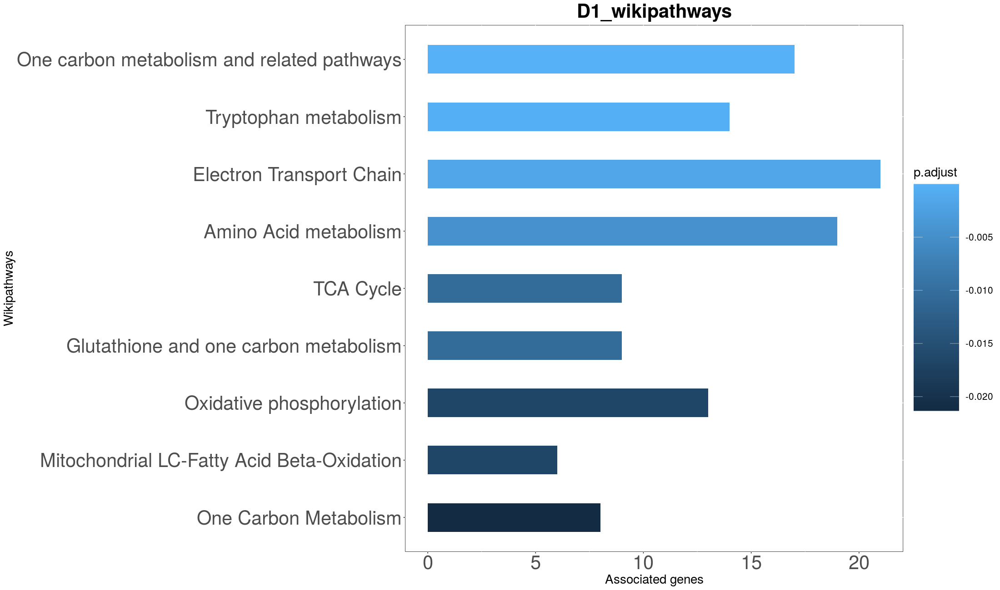

```

```{r echo=FALSE, out.width = "350px", out.height="300px", dpi=8}
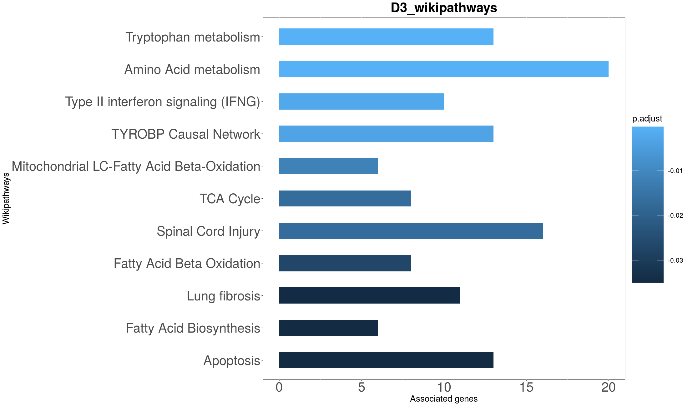
knitr::include_graphics("D7_wikipathways.png")
```

```{r echo=FALSE, out.width = "350px", out.height="300px", dpi=8}
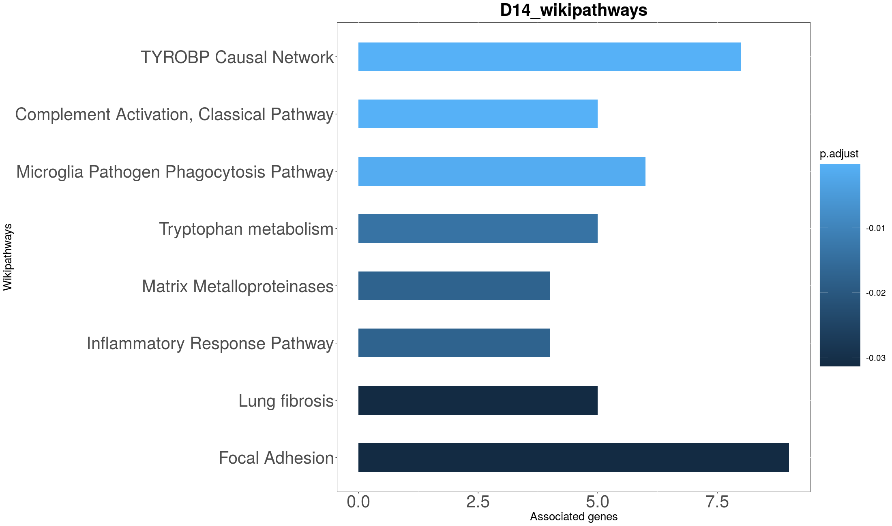
```

From here a WikiPathway can be selected for miR-mRNA interaction
analysis. If a pathway of interest is found, move onto part `2.7` of the 
vignette.

## Temporal Pathway Clustering Method

TimiRGeN also offers a supervised soft clustering method using Mfuzz [6, 27]. 
This provides a global view of temporal patterns based on the common genes found
between the each time point of the data and each pathway.

### Create Percent Matrix

```{r wikilist show, eval=FALSE, message=FALSE, warning=FALSE}
MAE2 <- wikiList(MAE2, stringSpecies = 'Mus musculus', stringSymbol = 'L')
```

This method starts by importing all mouse WikiPathways and associated gene IDs. The `L` symbol will give us entezgene IDs. Use the `En` symbol for ensembl IDs.

```{r wikilist working, echo=FALSE, message=FALSE, warning=FALSE}
# wikiList takes a large amount of time to complete, so to speed vignette
# building, w_list_mouse is used.
metadata(MAE2)[["wp_list"]] <- w_list_mouse
```

```{r wikiMatrix_Real, message=FALSE, warning=FALSE, echo=FALSE}
MAE2 <- wikiMatrix(MAE = MAE2, ID_list = metadata(MAE)[[4]],
                   wp_list = metadata(MAE2)[[1]])
```

```{r wikiMatrix_Show, message=FALSE, warning=FALSE, eval=FALSE}
MAE2 <- wikiMatrix(MAE = MAE2, ID_list = metadata(MAE)[[4]],
                   wp_list = metadata(MAE2)[[2]])
```

`wikiMatrix` will produce a matrix of common genes found between each time point
(rows) and each pathway (columns). A final row representing the total number of
genes in each pathway is added to the bottom of the matrix.

```{r Percent, message=FALSE, warning=FALSE}
MAE2 <- turnPercent(MAE = MAE2, wikiMatrix = assay(MAE2, 4))
```

`turnPercent` will normalise the number of genes found in each pathway by converting to percentages. This will account for pathways of differing sizes.

### Temporal Pathway Clustering

```{r createClusters_slow, eval=FALSE}
MAE2 <- createClusters(MAE = MAE2, method = "c",
                       percentMatrix = assay(MAE2, 5),
                       noClusters = 4, variance = 0.99)
```


```{r createClusters working, fig.align ="center",dpi=80, echo=FALSE}
# The createClusters function downloads data from the internet so it cannot
# pass bioconductor vignette building. For this reason clusterdata, mfuzzdata
# and clusters is imported from extdata.

load("../inst/extdata/clusterdata.rda")

load("../inst/extdata/mfuzzdata.rda")

MAEx <- MultiAssayExperiment(list('ClusterData' = clusterdata,
                                  'MuzzData' = mfuzzdata))
MAE2 <- c(MAE2, MAEx)

load("../inst/extdata/clusters.rda")

metadata(MAE2)[['Clusters']] <- clusters
```

`createClusters` uses functions from Mfuzz [6] to separate the `percentMatrix`
into a number of clusters based on temporal changes. In our example we created
12 clusters. Please refer to the Mfuzz source material for more information
[27].

Note. The message "genes excluded" refers to number of pathways excluded in TimiRGeN.

A standard deviation plot is created to show the variance found in each pathway over the time course. A PCA plot can also be created, this will show how close each
of the clusters are. Both plots are from Mfuzz functions [6].

```{r clusterCheck, message=FALSE, warning=FALSE, eval=FALSE}
clusterCheck(Clusters = metadata(MAE2)[[3]], W = FALSE)
```

### Plot Clusters

Once we are happy about the number of clusters, the fuzzy clusters can be 
plotted. Standardized values representing abundance are on the y axis and the 
time points are on the x axis.

```{r plot fuzzy clusters, message=FALSE, eval=FALSE}
quickFuzz(Mfuzzdata = experiments(MAE2)[[7]], Clusters = metadata(MAE2)[[3]],
          W = FALSE, background = "white", subcol = "black", 
          labelcol = "black", axiscol = "black", axisline = "black")
```

```{r FUZZ, echo=FALSE, out.width="800px", out.height="300px", dpi=8}
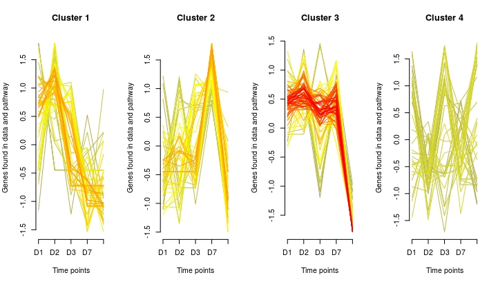
```

Each cluster represents a different temporal behaviour, and each cluster will consist of lines which will fit to varying degrees to each temporal behaviour. Colours of 
the lines will represent how well a particular pathway fits into a temporal behaviour. Red lines fit very well, orange lines fit fairly well, yellow lines somewhat fit and purple lines do not fit well.

Note. Clear plots after quickFuzz, as there could be visual defects in future
plots.

### Examine Clusters of Interest

```{r retrun cluster 1, warning=FALSE, message=FALSE}
MAE2 <- returnCluster(MAE2, clusterData = assay(MAE2, 6),
                     whichCluster = 1, fitCluster = 0.4)
```

## Take Selected Pathways Forward

```{r diffExpressRes, warning=FALSE, message=FALSE}
MAE2 <- diffExpressRes(MAE = MAE2, df = assay(MAE, 1), dataType = "Log2FC",
                genes_ID = assay(MAE, 3), name = "miR_log2fc")

MAE2 <- diffExpressRes(MAE = MAE2, df = assay(MAE, 2), dataType = "Log2FC",
                genes_ID = assay(MAE, 7), name = "mRNA_log2fc")
```

The `diffExpressRes` function will retrieve one specific result type from differential expression, along with either entrez gene IDs or ensembl gene IDs
from a `getIDs` function. It is recommend to use a DE results type which
represents abundance e.g. Log2FC.

Add a `name` to differentiate the results from `diffExpressRes`. Objects within MAEs cannot share the same name.

Note. Parameter `df` of `diffExpressRes` should not contain any NAs. Parameter
`genes_ID` can contain NAs.

### Find Common Genes in the Pathways of Interest and the Input mRNA Data

```{r mRNAs of interest, warning=FALSE, message=FALSE}
MAE2 <- reduceWiki(MAE = MAE2, path_data = assay(MAE2, 3),
                   stringWiki = 'Lung fibrosis')

MAE2 <- wikiMrna(MAE2, mRNA_express = assay(MAE2, 10),
                 singleWiki = assay(MAE2, 11),
                 stringWiki = 'Lung fibrosis')
```

Now we can identify which genes from a pathway of interest are in common with 
the input data. The `Lung fibrosis` pathway is used in this example.

## Create Correlation Matrix

```{r Correlation matrix, warning=FALSE, message=FALSE}
MAE3 <- MultiAssayExperiment()

MAE3 <- mirMrnaInt(MAE = MAE3,
                       miR_express = assay(MAE2, 9),
                       GenesofInterest = assay(MAE2, 12),
                       maxInt = 5)
```

`mirMrnaInt` creates a correlation matrix for every possible miR-mRNA
interaction between the `GenesofInterest` created from `wikiMrna` and all the
input miRs.

The `maxInt` parameter must be equal to the number of time points in the input 
data. The `corMeth` option allows users to select between pearson, spearman or
kendall, default being pearson.

## Download miR-mRNA Interaction Database Data

TargetScans v7.2, miRDB v6.0 and miRtaRBase v8.0 [8-10] can be used to
determine which of the potential miR-mRNA interactions have been predicted/
functionally validated.

The following code will download the latest versions of the databases
and format them for species specific miR-mRNA interaction mining.

For human analysis use `"hsa"` and `org.Hs.eg.db`.

Note. If timeout error occurs during downloads; increase it.

```{r miR-mRNA interaction databases, message=FALSE, warning=FALSE, eval=FALSE}
options(timeout=80) 
MAE3 <- dloadTargetscan(MAE = MAE3, species="mmu")

MAE3 <- dloadMirdb(MAE = MAE3, species="mmu", orgDB = org.Mm.eg.db)

MAE3 <- dloadMirtarbase(MAE = MAE3, species="mmu")
```

## Mine Predicted or Functionally Assessed miR-mRNA Interactions

```{r Data mining show, message=FALSE, warning=FALSE, eval=FALSE}
MAE3 <- dataMiningMatrix(MAE = MAE3, corrTable = assay(MAE3, 1),
                         targetscan = assay(MAE3, 2),
                         mirdb = assay(MAE3, 3),
                         mirtarbase = assay(MAE3, 4))
```

```{r Datamining working, echo=FALSE}
# Because the dload functions could not be performed in vignette building, 
# Int_data is included.

load("../inst/extdata/Int_data.rda")

X <- MultiAssayExperiment(list(MiningMatrix = Int_data))

MAE3 <- c(MAE3, X)
```

The `dataMiningMatrix` function will identify if any of the potential miR-mRNA
interactions from the `mirMrnaInt` function are predicted/ functionally 
assessed, and display this as integers.

### Filter Out miR-mRNA Interactions Based on Evidence

```{r matrixFilter show, warning=FALSE, message=FALSE, eval=FALSE}
MAE3 <- matrixFilter(MAE = MAE3, miningMatrix = assay(MAE3, 5),
                     negativeOnly = TRUE,
                     predictedOnly = FALSE,
                     threshold = 2,
                     maxCor = -0.5)
```

```{r matrixFilter working, warning=FALSE, message=FALSE, echo=FALSE}
# Because dload functions are not evaluated, assay(MAE3, 5) should be
# assay(MAE3, 2).

MAE3 <- matrixFilter(MAE = MAE3, miningMatrix = assay(MAE3, 2),
                     negativeOnly = TRUE,
                     predictedOnly = FALSE,
                     threshold = 2,
                     maxCor = -0.5)
```

Potential interactions with no-little evidence can be filtered out using
parameters on `matrixFilter`.

`NegativeOnly` being `TRUE` will only filter for interactions with a negative
average correlation.
`PredictedOnly` being `TRUE` will ignore interactions found on miRTarBase.
`THRESHOLD` being `2` will filter for interactions that have been predicted/ validated by two or more databases.
`maxCor` being `-0.5` will remove any interactions that have an average 
correlation greater than `-0.5`.

## Create Internal R Networks

```{r CreateNetwork, message=FALSE, warning=FALSE, eval=FALSE}
MAE3 <- makeNet(MAE = MAE3, filt_df = assay(MAE3, 6))

quickNet(net = metadata(MAE3)[[1]])
```

Utilising igraph [7] the filtered miR-mRNA interactions can be displayed. The
colour of the edges represents the level of correlations between the
miRs and mRNAs.

```{r netmake, echo=FALSE, dpi=8}

```

Note. Adjustments to the size of the plot window may be needed to access the key in the bottom left hand side.

Note. Having too many interactions will be very difficult to see in R, so
it's recommend exporting this data into Cytoscape in these cases.

Note. Filtered miR-mRNA interactions must consist of at least two miR-mRNA interactions or this plot will not work and input time series must have at least three time points.

## Hierarchical clustering of genes found in pathways of interest

Once a pathway of interest is selected and miR-mRNA interactions have
been filtered, a suite of longitudinal analysis tools are available to inspect
relationships between the miRNA-mRNA interactions. Firstly hierarchical 
clustering can be performed on the genes of interest.

```{r Hierarchical1, message=FALSE, warning=FALSE, eval=FALSE}
quickPathwayTC(filt_df = assay(MAE3, 6), miRNA_exp = assay(MAE2, 9),
               mRNA_exp = assay(MAE2, 10), morethan = TRUE, threshold = 1,
               pathwayname = "Lung fibrosis")

quickDendro(filt_df = assay(MAE3, 6), miRNA_exp = assay(MAE2, 9),
           mRNA_exp = assay(MAE2, 10), pathwayname = "Lung fibrosis")

quickDMap(filt_df = assay(MAE3, 6), miRNA_exp = assay(MAE2, 9), mRNA_exp = assay(MAE2, 10), pathwayname = "Lung fibrosis")

quickHClust(filt_df = assay(MAE3, 6), miRNA_exp = assay(MAE2, 9),
            mRNA_exp = assay(MAE2, 10), pathwayname = "Lung fibrosis", k = 3,
            cluster = 1)

```

`quickPathwayTC` will generate a time course consisting of each gene
of interest from the selected pathway. Certain genes can be highlighted based
on their relative expression levels. Code for this section was
ammended from this blog [31].

```{r qpTC, echo=FALSE, out.width = "400px",out.height= "400px", dpi=8}
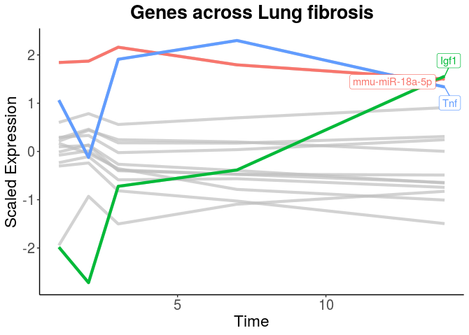
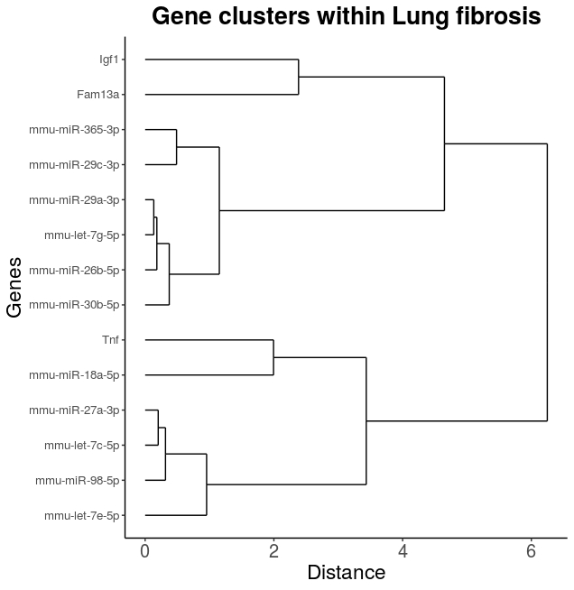
```

`quickDendo` will generate a dendrogram of the mRNAs and miRNAs involved with
the pathway of interest. 

From here `quickHClust` will plot the genes from a selected cluster. In this 
examples 3 (`k`) clusters were created.

## Correlation and Cross Correlation analysis of miRNA:mRNA pairs

For analysis of individual miRNA-mRNA interactions, TimiRGeN provides options
to generate correlation plots and cross-correlation plots. These pair analysis
methods is ideal for longer time courses with at least five time points. Shorter
time series are not appropriate and warning messages will display this.

```{r corranalysis, message=FALSE, warning=FALSE, eval=FALSE}
quickMap(filt_df = assay(MAE3, 6), numpairs = 11)

quickTC(filt_df = assay(MAE3, 6), miRNA_exp = assay(MAE2, 9),
        mRNA_exp = assay(MAE2, 10), pair = 1, scale = FALSE,
        Interpolation = TRUE, timecourse = 14)

quickCrossCorr(filt_df = assay(MAE3, 6), miRNA_exp = assay(MAE2, 9),
               mRNA_exp = assay(MAE2, 10), pair = 1, scale = FALSE,
               Interpolation = FALSE)
```

`quickMap` will show all miRNA-mRNA interaction pairs in descending order
of correlation. 

`quickTC` will contrast the correlation over time for a selected pair and
`quickCrossCorr` will generate of cross-correlation plot to analyse the relationship between the two time series (miRNA and mRNA). Specifically at which point the two time series
are best matched.

```{r corplot, echo=FALSE, out.width = "400px",out.height= "400px", di = 8}
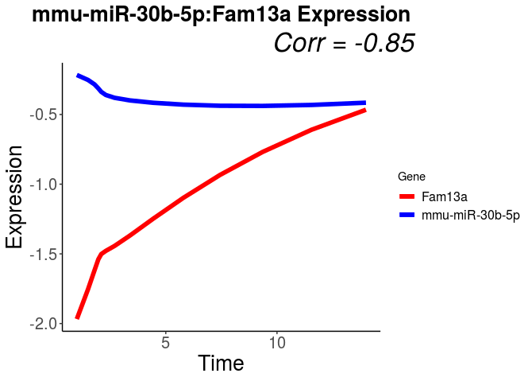
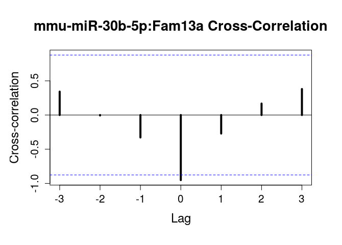
```


## Regression analysis of mRNAs regulated by miRNAs
`TimiRGeN` can also plot regression for miRNA-mRNA interactions.
Furthermore, based on the expression levels of an interacting miR, the mRNA expression levels can be predicted and the accuracy calculated. This can also be done for a miR. Interestingly this can also be performed for multi miRNA/  mRNA interactions, e.g. `Igf1` has many miRNA binding partners and this can be explored by regression.

```{r reganaysis, message=FALSE, warning=FALSE, eval=FALSE}
MAE3 <- multiReg(MAE = MAE3, gene_interest = "Igf1", mRNAreg = TRUE,
                 filt_df = assay(MAE3, 6), miRNA_exp = assay(MAE2, 9),
                 mRNA_exp = assay(MAE2, 10))


model1 <- linearRegr(mreg = assay(MAE3, 7), colpair = 3, alterpairs = c(4, 5))
summary(model1$regression)

model2 <- linearRegr(mreg = assay(MAE3, 7), colpair = 5)
summary(model2$regression)

quickTCPred(model = model1, reg_df = assay(MAE3, 7))

quickReg(reg_df = assay(MAE3, 7), colselect = 3)
quickReg(reg_df = assay(MAE3, 7), colselect = 6)
```

`multiReg` will generate a matrix of a gene of interest (mRNA or miRNA) and
all it's predicted binding partners. The `linearRegr` can be used to create
a linear model out of several of the genes used in `multiReg`. 

Note. If many genes are used in `linearRegr` NANs may appear. For this reason 
try testing out different combination of formulas. 

`quickTCPred` generates a multi-regression plot from the formula made by `linearRegr`. This plot will have data from the analysis and a predicted
simulation. R.squared and P value is generated and pasted onto the plot. 

```{r TCpred, ig.align="center", echo=FALSE, out.width = "500px",out.height= "500px", di = 8}
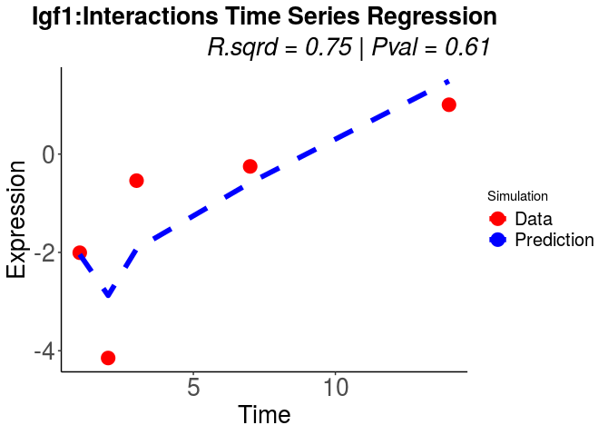
```

Lasty, `quickReg` will generate a simple regression plot between a miRNA-mRNA interacting pair of choice. The odds-ratio and confidence intervals for 95% will be calculated and pasted onto the plot.

Note Regression and correlation analysis is suitable for longer and more regular time series. Section 5 discusses how longer time series datasets may be with TimiRGeN if users do not wish to perform pair-wise DE.

## Output for Pathvisio

```{r Make Output for Pathvisio show, eval=FALSE}
MAE3 <- makeMapp(MAE3,
                 filt_df = assay(MAE3, 6),
                 miR_IDs_adj = assay(MAE, 5),
                 dataType = 'L')

MAE3 <- makeDynamic(MAE = MAE3,
                    miR_expression = assay(MAE2, 9),
                    mRNA_expression = assay(MAE2, 10),
                    miR_IDs_adj = assay(MAE, 5),
                    dataType = 'L')

write.table(assay(MAE3, 8), "MAPP.txt", quote = FALSE,
            row.names = FALSE, col.names = FALSE,
            sep = "\t")

write.csv(assay(MAE3, 9), "Dynamics.csv", row.names = TRUE,
          quote = FALSE)
```

TimiRGeN creates two types of files which can be imported by PathVisio [12]. Firstly, MAPP data which contains miR information. This can be imported into PathVisio via the 
[MAPPbuilder](https://pathvisio.github.io/plugins/plugins-repo) app. 
This will allow all the miRs to be imported at once. From here some manual adjustments are necessary to properly place the miRs where they are predicted to
be effecting the signalling pathway. Next is the Dynamic data which can be 
imported as an expression data set to visualise the changes that occur to the pathway along the time course.

Please follow the instructions in the (Pathvisio_GRN_guide.pdf)[https://github.com/Krutik6/TimiRGeN/issues/2]
for the reccomended method for GRN construction. If any entrezgene/ ensembl IDs are missing,
it is recommended to annotate them manually in the MAPP and Dynamics
files before importing them into PathVisio. It is also recommended to go through
PathVisio [tutorials](https://pathvisio.github.io/tutorials) [12] for better 
usage of the network visualisation tool.

## Output to Cytoscape

```{r cytoscape, message=FALSE, warning=FALSE, eval=FALSE}
RCy3 :: cytoscapePing()

cytoMake(assay(MAE3, 6),
         titleString = 'Lung Fibrosis Pathway',
         collectionString = 'PathwaysforKidneyFibrosis')
```

The internal R network generated by `quickNet` can be exported into Cytoscape 
[11] by using functions from RCy3 [5]. TimiRGeN has wrapped around several of 
these functions to make the process quicker. This will be useful if many 
miR-mRNA interactions have been found and the internal R graphics cannot cope 
with this.

Make sure Cytoscape version 3.7 or newer is opened, and check if R recognises 
that Cytoscape is open by using using the `cytoscapePing()` function. From here further investigation is possible by using cytoscape apps.

# Separated miR-mRNA Analysis

TimiRGeN also offers the option of analysing the miR and mRNA data separately.
Many functions are similar to the combined method, but the `"s"` mode is used
for some functions, rather than the `"c"` mode.

To go through this we are using a Human Breast Cancer dataset which had 
Hypoxia induced. This data was published in
[Camps et al (2014)](https://www.ncbi.nlm.nih.gov/pmc/articles/PMC3928101/)
[28]. The mRNA data was downloaded from GSE47533 and the miR data was downloaded from GSE47532.

## Load Data

```{r loadhuman, message=FALSE, warning=FALSE}
library(org.Hs.eg.db)

data("hs_miR")

rownames(hs_miR) <- gsub(rownames(hs_miR), pattern = "\\.", replacement = "-")

rownames(hs_miR) <- sub("-$", "*", rownames(hs_miR))
```

For TimiRGeN to work the rownames and colnames must adhere to naming
conventions. As mentioned above, the time point should be the first part of 
each column name and the result type from
differential expression analysis (Log2FC, adjPVal) should be
the second part of the column name. These two parts must be separated by a
`.`, which can be the only `.` in the column name string.

Furthermore, there should be no `_` characters in the column names.
Acceptable names: D1.log2fc, H5.ajdpval, TP8.zscore ect.
Not acceptable names: D.1.log2fc, H5_adjpval, TP8zscore.

For microRNAs (because naming conventions vary quite a bit),
TimiRGeN uses it's own naming convention which must be adhered to.
A `-` should separate parts of the microRNA name e.g. mmu-miR-193a, 
mmu-miR-140-5p, hsa-let-7a. The human miR data loaded in this example is from a dataset which uses `.` instead of `-`, in the miR names. Depending on your own data, you may have to change the nomenclature to run the data through TimiRGeN, 
like what was done above.

Some miR data will have a `.` at the end of the gene names because there can be multiple transcripts with the same name. It is best to keep these extra genes. It is recommended to replace the final `.` with a `*` symbol to make this more obvious.

```{r loadmRNA, message=FALSE, warning=FALSE}
data("hs_mRNA")

MAE <- startObject(hs_miR, hs_mRNA)

MAE <- getIdsMir(MAE = MAE, assay(MAE, 1), orgDB = org.Hs.eg.db, miRPrefix = 'hsa')

MAE <- getIdsMrna(MAE = MAE, assay(MAE, 2), mirror = 'useast', species = 'hsapiens', orgDB = org.Hs.eg.db)
```

## Differentiate Data

```{r addPrefix, message=FALSE, warning=FALSE}
MAE <- addPrefix(MAE = MAE, gene_df = assay(MAE, 1),
                 prefixString = "miR")

MAE <- addPrefix(MAE = MAE, gene_df = assay(MAE, 2),
                 prefixString = "mRNA")
```

`addPrefix` function will differentiate the miR and mRNA column names. Add a 
unique `prefixString` to the miR and mRNA data to do this. This must be used for `"s"` analysis.

## Find Significantly Differentially Expressed Genes per Timepoint

```{r siggenes, warning=FALSE, message=FALSE}
MAE <- genesList(MAE = MAE, method = 's',
                 miR_data = assay(MAE, 9),
                 mRNA_data = assay(MAE, 10))

MAE <- significantVals(MAE = MAE, method = 's',
                       geneList = metadata(MAE)[[1]],
                       maxVal = 0.05, stringVal = "adjPVal")
```

## Get Significantly Differentially Expressed Gene IDs

```{r getensemblids, warning=FALSE, message=FALSE}
MAE <- addIds(MAE = MAE, method = 's',
              filtered_genelist = metadata(MAE)[[2]],
              miR_IDs = assay(MAE, 4),
              mRNA_IDs = assay(MAE, 8))

MAE <- eNames(MAE = MAE, method = 's', gene_ID = metadata(MAE)[[3]])
```

## Enrichment Method on Separated Data

Here we use ensemble data instead of entrezgene ID. Use the `gmtEnsembl` function to get WikiPathways data which is curated with ensembl IDs.

```{r hs dloadGmt show, eval=FALSE, message=FALSE, warning=FALSE}
MAE2 <- MultiAssayExperiment()

MAE2 <- dloadGmt(MAE = MAE2, species = "Homo sapiens")
```

```{r convert to ensembl, eval=FALSE, message=FALSE, warning=FALSE}
MAE2 <- gmtEnsembl(MAE = MAE2, path_gene = assay(MAE2, 1),
                    path_data = assay(MAE2, 3),
                    orgDB = org.Hs.eg.db)
```

```{r hs dloadGmt working, echo=FALSE}
# dloadGmt failed on bioconductor vignette build so hs_gmt is added instead
# hs_gmt contains the MAE that would have been produced by gmtEnsembl.
load(file = "../inst/extdata/hs_gmt.rda")
MAE2 <- hs_gmt
```

Since this dataset was from microarray data, it is useful to use the probes
as the backround/ universe. This will tell us, out of all the genes captured
by the microarrays, which are significantly overexpressed within WikiPathways.
For this, users will need to create their own universe (list of annotation IDs
stored as characters). For this dataset a list of available annotation IDs
was created using downloadable data from [Agilent-019118 Human miRNA Microarray 2.0 G4470B (miRNA ID version)](https://www.ncbi.nlm.nih.gov/geo/query/acc.cgi?acc=GPL8227) and [Illumina HumanWG-6 v3.0 expression beadchip](https://www.ncbi.nlm.nih.gov/geo/query/acc.cgi?acc=GPL6884). 

```{r message=FALSE, warning=FALSE, eval=FALSE}
data("hs_probes")

MAE2 <- enrichWiki(MAE = MAE2, method = 's',
                   ID_list = metadata(MAE)[[4]],
                   orgDB = org.Hs.eg.db,
                   path_gene = assay(MAE2, 4),
                   path_name = assay(MAE2, 2),
                   ID = 'ENSEMBL',
                   universe = hs_probes$ensembl_gene_id)

```

```{r saveplots_s, eval=FALSE}
savePlots(largeList = metadata(MAE2)[[1]], maxInt = 6,
          fileType = "jpeg")
```

Note. If there are not enough enriched pathways found with the `"s"` method,
over representation analysis will fail. This occurs often with microRNA data because not many pathways have microRNAs within them. If this occurs, try to use the `"c"` method for miR-mRNA GSEA analysis.

## Temporal Clustering Method on Separated Data

```{r human wikiList show, eval=FALSE}
MAE2 <- wikiList(MAE = MAE2, stringSpecies = "Homo sapiens",
                 stringSymbol = "En")
```

```{r human wikiList working, echo=FALSE}
# Loading w_list_human instead to speed up vignette building

load("../inst/extdata/w_list_human.rda")

metadata(MAE2)[['wikilist']] <- w_list_human
```

```{r create_percent_matrix, warning=FALSE, message=FALSE, eval=FALSE}
MAE2 <- wikiMatrix(MAE = MAE2, ID_list = metadata(MAE)[[4]],
                   wp_list = metadata(MAE2)[[2]])

MAE2 <- turnPercent(MAE = MAE2, wikiMatrix = assay(MAE2, 6))
```

Insert `miR` or `mRNA` as `Data_string` for `createClusters`. This should be the same as the `prefixString` added before.

```{r ensembl human clusters show, warning=FALSE, message=FALSE, eval=FALSE}
MAE2 <- createClusters(MAE = MAE2, method = "s",
                       dataString = "mRNA",
                       percentMatrix = assay(MAE2, 7),
                       noClusters = 2,
                       variance = 0.99)

clusterCheck(Clusters = metadata(MAE2)[[3]], W = FALSE)

quickFuzz(Mfuzzdata = experiments(MAE2)[[9]],
          Clusters = metadata(MAE2)[[3]],
          W = FALSE)

MAE2 <- returnCluster(MAE2, clusterData = assay(MAE2, 8),
                      whichCluster = 1,
                      fitCluster = 0.5)

```

From here, once a pathway of interest is found, continue on from section `2.7`  to generate miR-mRNA interaction networks. 

# Only mRNA data

If only mRNA or miR data is available, this can also be put through
TimiRGeN for time course analysis.

It is easier to run mRNA data by itself, rather than miR data because very few
miRs are annotated within signalling pathways.

Note. Conditional data should work here as well.

```{r mRNA only, message=FALSE, warning=FALSE, eval=FALSE}
data("mm_mRNA")

Data <- startObject(miR = NULL, mRNA = mm_mRNA)

Data <- getIdsMrna(MAE = Data, mRNA = assay(Data, 2), mirror = 'useast',                          species = 'mmusculus', orgDB = org.Mm.eg.db)

Data <- genesList(Data, 
                  method = 'c',
                  genetic_data = assay(Data, 2),
                  timeString = 'D')

Data <- significantVals(Data, method = 'c',
                        geneList = metadata(Data)[[1]],
                        maxVal = 0.05,
                        stringVal = 'adjPVal')

Data <- addIds(MAE = Data, method = 'c',
               filtered_genelist = metadata(Data)[[2]],
               miR_IDs = assay(Data, 3),
               mRNA_IDs = assay(Data, 3))

Data <- eNames(MAE = Data, method = 'c', 
               gene_IDs = metadata(Data)[[3]])

Data2 <- MultiAssayExperiment()

Data2 <- dloadGmt(MAE = Data2, species = "Mus musculus")

Data2 <- enrichWiki(MAE = Data2, method = 'c',
                    ID_list = metadata(Data)[[4]],
                    orgDB = org.Mm.eg.db,
                    path_gene = assay(Data2, 1),
                    path_name = assay(Data2, 2),
                    ID = "ENTREZID",
                    universe = assay(Data2, 1)[[2]])

quickBar(X = metadata(Data2)[[1]][[1]], Y = names(metadata(Data2)[[1]][1]))
```

# TimiRGeN for longer time courses

If users have longer time courses they may wish to perform differential expression over a cubic spline or use the "LRT" method in DESeq2, among other options. In this case, they will not be able to retrieve a Log2FC and adjusted P value per time point. TimiRGeN can still accommodate for this. After a non pair-wise based DE experiment, users should filter out significantly DE genes from averaged normalised or raw counts/ expression values. Naming conventions for the column names and microRNA names will be the same as for pair-wise DE analysis input. There should only be one column for each time point.

For a less stringent analysis it is recommended to use all the microRNAs available, rather than only the significantly differentially expressed ones.

In this example a subset of data from a [breast cancer dataset](https://www.ncbi.nlm.nih.gov/geo/query/acc.cgi?acc=GSE78169) is used. It can be downloaded from GSE78169 [29].

```{r Long_analysis, eval=FALSE}
library(TimiRGeN)
library(org.Hs.eg.db)

data(long_data)
miRNA <- long_data[c(1:105),]
mRNA <- long_data[-c(1:105),]

MAE <- startObject(miRNA, mRNA)

MAE <- getIdsMir(MAE = MAE, miR = MAE[[1]], orgDB = org.Hs.eg.db,
                 miRPrefix = "hsa")

MAE <- getIdsMrna(MAE = MAE, mRNA = MAE[[2]], mirror = "www",
                  species = "hsapiens", orgDB = org.Hs.eg.db)

MAE <- combineGenes(MAE = MAE, miR_data = MAE[[1]], mRNA_data = MAE[[2]])

MAE <- genesList(MAE = MAE, method = "c", genetic_data = MAE[[9]],
                 timeString = "H", miR_data = )

MAE <- addIds(MAE = MAE, method = "c", filtered_genelist = metadata(MAE)[[1]], 
              miR_IDs = MAE[[3]], mRNA_IDs = MAE[[7]])

MAE <- eNames(MAE = MAE, method = "c", gene_IDs = metadata(MAE)[[2]])

MAE2 <- MultiAssayExperiment()

MAE2 <- dloadGmt(MAE = MAE2, species = "Homo sapiens")

MAE2 <- enrichWiki(MAE = MAE2, method = "c", ID_list = metadata(MAE)[[3]],
                   orgDB = org.Hs.eg.db, path_gene = MAE2[[1]], 
                   path_name = MAE2[[2]], ID = "ENTREZID", 
                   universe = MAE2[[1]][[2]])

quickBar(metadata(MAE2)[[1]][[1]], Y = "Enriched Pathways")

```

Here pathways that are enriched over the entire time course can be identified.

Alternatively, users that use averaged expression data as an input can 
create temporal clusters from their miRNA-mRNA data. From here genes which
associate with a temporal cluster can be sorted and used as input for
overrepresentation analysis. 

```{r longclutsers, warning=FALSE, message=FALSE, eval=FALSE}
library(TimiRGeN)
library(org.Hs.eg.db)

data(long_data)
miRNA <- long_data[c(1:105),]
mRNA <- long_data[-c(1:105),]

MAE <- startObject(miRNA, mRNA)

MAE <- getIdsMir(MAE = MAE, miR = MAE[[1]], orgDB = org.Hs.eg.db,
                 miRPrefix = "hsa")

MAE <- getIdsMrna(MAE = MAE, mRNA = MAE[[2]], mirror = "www",
                  species = "hsapiens", orgDB = org.Hs.eg.db)

MAE <- combineGenes(MAE = MAE, miR_data = MAE[[1]], mRNA_data = MAE[[2]])

MAE <- createClusters2(MAE = MAE, genetic_data = assay(MAE, 9))

quickFuzz(Mfuzzdata = MAE[[11]], Clusters = metadata(MAE)[[1]], 
          ylab="Standardised Gene Expression")

MAE <- clusterList(MAE = MAE, clusterData = assay(MAE, 10),
                   fitCluster = 0.5, miR_IDs = assay(MAE, 3),
                   mRNA_IDs = assay(MAE, 7))

MAE2 <- MultiAssayExperiment()

MAE2 <- dloadGmt(MAE = MAE2, species = "Homo sapiens")

MAE2 <- enrichWiki(MAE = MAE2, method = "c", ID_list = metadata(MAE)[[2]],
                   orgDB = org.Hs.eg.db, path_gene = MAE2[[1]], 
                   path_name = MAE2[[2]], ID = "ENTREZID", 
                   universe = MAE2[[1]][[2]])

savePlots(largeList = metadata(MAE2)[[1]], maxInt = 5, fileType = "png")
```

Once a pathway of interest has been found, users can continue on miRNA-mRNA pathways analysis from section `2.7`. 

# Meta-analysis of time series datasets with TimiRGeN

Some datasets may include time as one of several interventions. TimiRGeN "vanilla" usage considers time as the only variable. However, the downstream analysis can be used as a form of meta-analysis between multiple interventions over time. 

A time series dataset of surgically induced mouse kidney fibrosis was also generated and downloaded from this repository [GSE118341](https://www.ncbi.nlm.nih.gov/geo/query/acc.cgi?acc=GSE118341) [30].
The time series datasets (Unilateral ureter obstruction (UUO) was run through TimiRGeN (following the code found in section 2). Folic acid data was also
run through the same analysis in section 2. Results from the analysis can
be contrasted to find differences between kidney fibrosis via FA and UUO.

```{r loadUUO, message=FALSE, warning=FALSE}
data("UUO_data")
UUO_miRNA <- UUO_data[c(1:240),]
UUO_mRNA <- UUO_data[-c(1:240),]
```

```{r netcontrast,out.width="400px",out.height="400px",echo=FALSE,dpi=8}

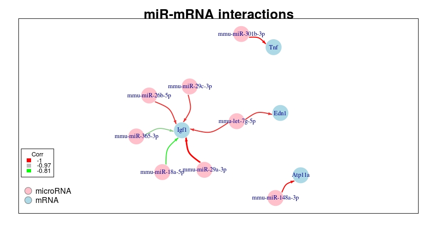
```

Both FA (left) and UUO (right) show that `Igf1` is targetted by `mmu-miR-18a-5p`. Regression analysis can contrast this miRNA-mRNA pair in 
both datasets.

```{r regcontrast,out.width="400px",out.height="400px",echo=FALSE,dpi=8}
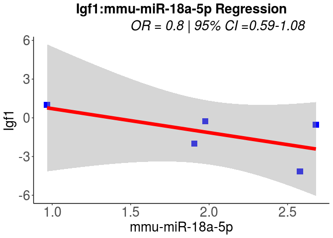
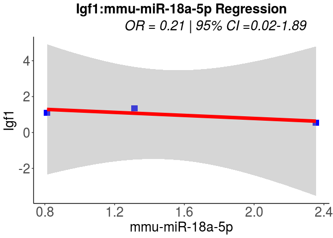
```

It seems we can be confident that the `Ifg1-mmu-miR-18a-5p` interaction has stronger relationship in the FA dataset than in the UUO dataset due to the higher odd-ratio and the lower range of the 95% confidence intervals.

Notably this example also shows warnings from the UUO dataset because it only
has three time points. Such datasets will produce warning messages when users
try to perform cross-correlation analysis, interpolation and regression analysis.

# References

1. Denise N Slenter et al. “WikiPathways: a multifaceted pathway database
bridging metabolomics to other omics research”. In: Nucleic acids research
46.D1 (2018), pp. D661–D667.
2. Guangchuang Yu et al. “clusterProfiler: an R package for comparing bi-
ological themes among gene clusters”. In: Omics: a journal of integrative
biology 16.5 (2012), pp. 284–287.
3. Guangchuang Yu et al. “DOSE: an R/Bioconductor package for disease
ontology semantic and enrichment analysis”. In: Bioinformatics 31.4 (2014),
pp. 608–609.
4. Damian Smedley et al. “BioMart–biological queries made easy”. In: BMC
genomics 10.1 (2009), p. 22.
5. Julia A Gustavsen et al. “RCy3: Network biology using Cytoscape from
within R”. In: F1000Research 8 (2019).
6. Lokesh Kumar and Matthias E Futschik. “Mfuzz: a software package for
soft clustering of microarray data”. In: Bioinformation 2.1 (2007), p. 5.
7. Maintainer Gabor Csardi. “Package igraph”. In: Last accessed 3.09 (2013),
p. 2013.
8. Vikram Agarwal et al. “Predicting effective microRNA target sites in
mammalian mRNAs”. In: elife 4 (2015), e05005.
9. Yuhao Chen and Xiaowei Wang. "miRDB: an online database for prediction of
functional microRNA targets". In: Nucleic Acids Research.48.D1 (2020), pp 
D127-D131.
10. Hsi-Yuan Huang et al. "miRTarBase 2020: updates to the experimentally 
validated microRNA–target interaction database.In: Nucleic Acids Research".
48.D1 (2020), pp D148–D154.
11. Michael E Smoot et al. “Cytoscape 2.8: new features for data integration
and network visualization”. In: Bioinformatics 27.3 (2010), pp. 431–432.
12. Martijn P van Iersel et al. “Presenting and exploring biological pathways
with PathVisio”. In: BMC bioinformatics 9.1 (2008), p. 399.
13. Alexander R Pico et al. “WikiPathways: pathway editing for the people”.
In: PLoS biology 6.7 (2008), e184.
14. Hadley Wickham et al. “dplyr: a grammar of data manipulation, 2013”.
In: URL https://github.com/hadley/dplyr. version 0.1.[p 1] (2017).
15. Gregory R Warnes, Ben Bolker, and Thomas Lumley. “gtools: Various R
programming tools”. In: R package version 3.1 (2014).
16. Hadley Wickham and Lionel Henry. “Tidyr: Easily tidy data withspread
()andgather ()functions”. In: R package version 0.6 1 (2017).
17. Hadley Wickham. “stringr: Make it easier to work with strings”. In: R
package version 0.6 2 (2012), pp. 96–7.
18. Hadley Wickham. ggplot2: elegant graphics for data analysis. Springer 2016.
19. Carlson M (2019). org.Hs.eg.db: Genome wide annotation for Human. R package
version 3.8.2.
20. Carlson M (2019). org.Mmu.eg.db: Genome wide annotation for Rhesus. R
package version 3.8.2.
21. Claus Thorn Ekstrom. R Primer. Chapman and Hall/CRC, 2019.
22. Ramos M, Schiffer L, Re A, Azhar R, Basunia A, Cabrera CR, Chan T, Chapman
P, Davis S, Gomez-Cabrero D, Culhane AC, Haibe-Kains B, Hansen K, Kodali H,
Louis MS, Mer AS, Reister M, Morgan M, Carey V, Waldron L (2017). “
Software For The Integration Of Multi-Omics Experiments In Bioconductor.”
Cancer Research, 77(21); e39-42.
23. de Vries, Andrie, and Brian D. Ripley. "ggdendro: Create Dendrograms and Tree Diagrams Using’ggplot2’." R package version 0.1-20 (2016).
24. Wickham, Hadley. "reshape2: Flexibly reshape data: a reboot of the reshape package." R package version 1.2 (2012).
25. Florin L Craciun et al. “RNA sequencing identifies novel translational
biomarkers of kidney fibrosis”. In: Journal of the American Society of
Nephrology 27.6 (2016), pp. 1702–1713.
26. Kathryn L Pellegrini et al. “Application of small RNA sequencing to iden-
tify microRNAs in acute kidney injury and fibrosis”. In: Toxicology and
applied pharmacology 312 (2016), pp. 42–52.
27. Matthias E Futschik and Lokesh Kumar. “Introduction to Mfuzz package
and its graphical user interface”. In: (2013).
28. Carme Camps et al. “Integrated analysis of microRNA and mRNA expres-
sion and association with HIF binding reveals the complexity of microRNA
expression regulation under hypoxia”. In: Molecular cancer 13.1 (2014),
p. 28.
29. Baran-Gale J, Purvis JE, Sethupathy P. "An integrative transcriptomics approach identifies miR-503 as a candidate master regulator of the estrogen response in MCF-7 breast cancer cells". RNA (2016), pp. 1592-603.
30. Pavkovic M, Pantano L, Gerlach CV, Brutus S et al. "Multi omics analysis of fibrotic kidneys in two mouse models". Sci Data (2019).
31. Aleszu Bajak. How to use hierarchical cluster analysis on time series data (2019) https://www.storybench.org/how-to-use-hierarchical-cluster-analysis-on-time-series-data/
