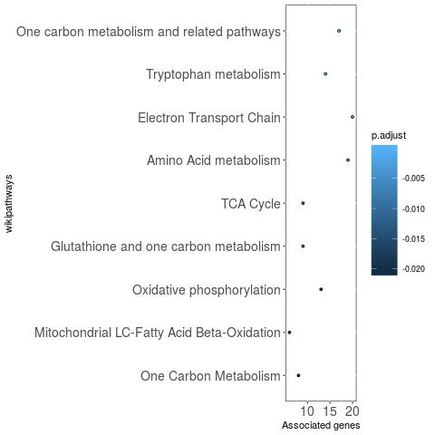
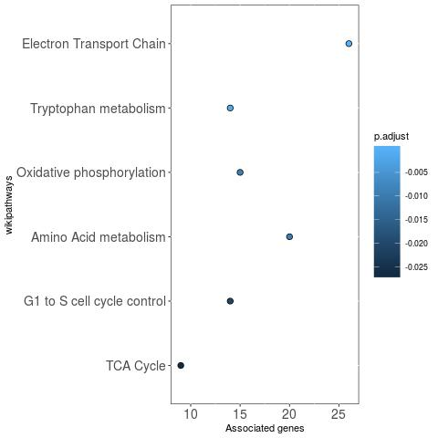
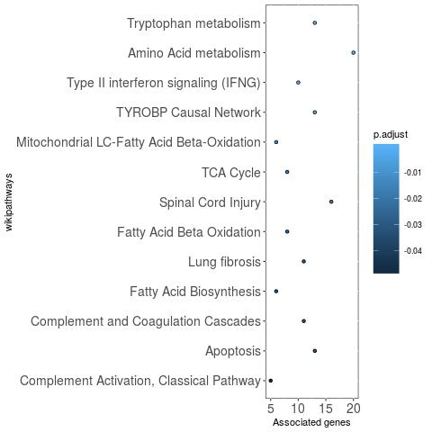
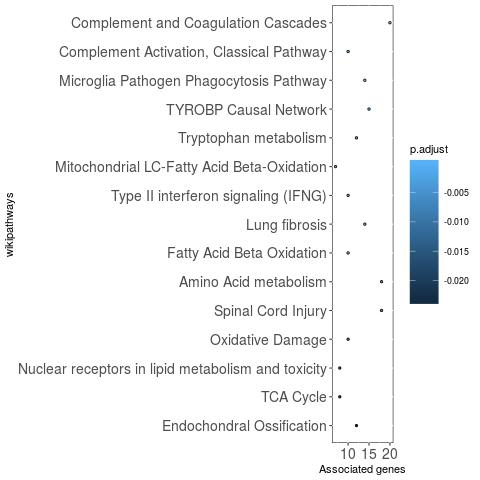
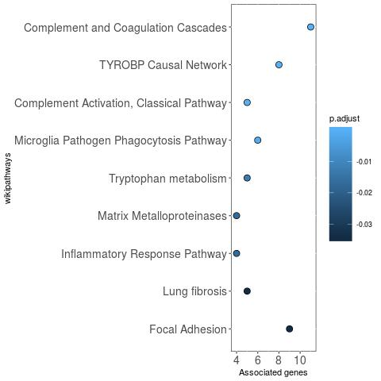
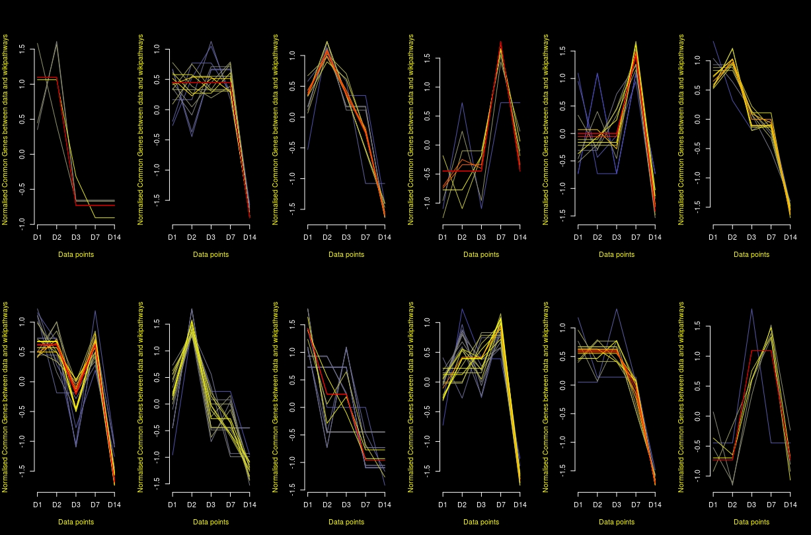
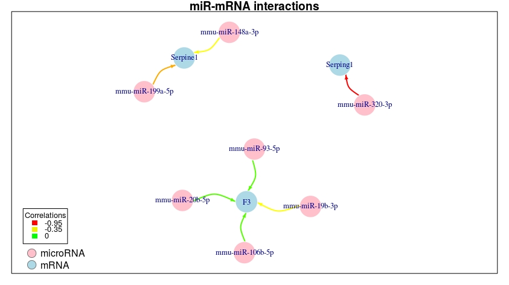
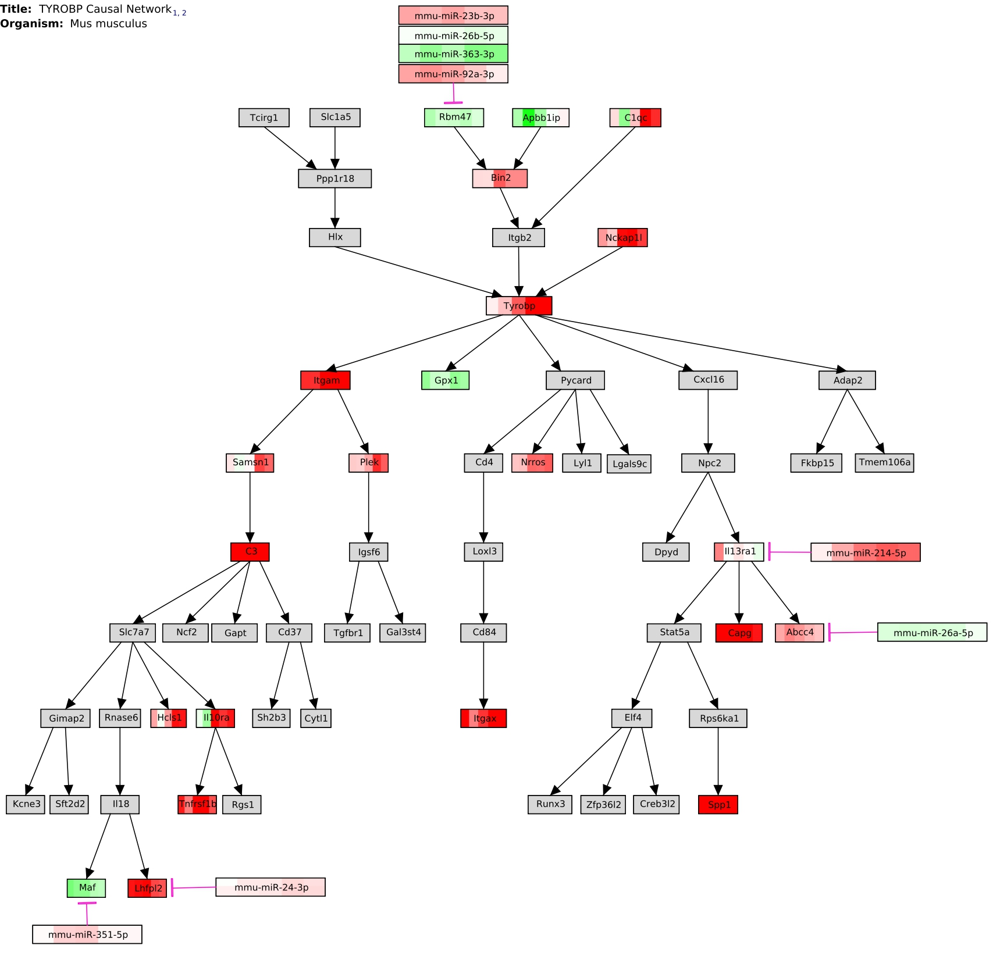
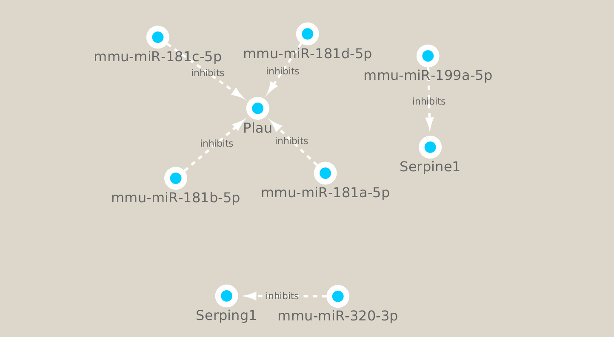
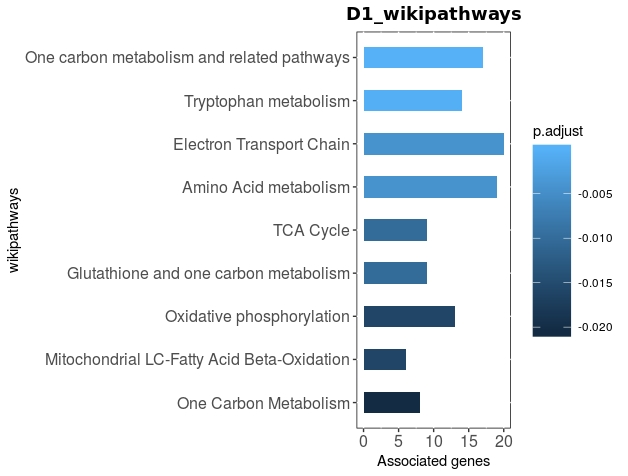

```{r setup, include=FALSE, results='asis', warning=FALSE}
knitr::opts_chunk$set(echo = TRUE, tidy = TRUE, warning = FALSE,
message = FALSE)
options(width = 800)
```

#Introduction
systems microRNA kinetics (smiRk) is aimed at researchers who wish
to explore time series microRNA-mRNA data. This package integrates, 
functionally analyses and generates small networks which can help to
generate hypothesis.

There are many microRNA (miR) and mRNA data integration and analysis packages, 
however they tend to usually be capable of a few tasks necessary for analysing
this type of data. The most important outcome which many of these tools do 
not achieve is reduction in the volume of data. The pipeline of the package 
takes inspiration from many of the previously published miR-mRNA integration 
tools to perform a more complete task. Furthermore, this package is made to
deal with time series miR-mRNA data which is a growing resource in biology.

To achieve data reduction without reducing biological signal, the smiRk package 
utilises several published packages and employs their functions 
in a synergistic fashion for time series multi-omic analysis. The following
packages have been built upon for several functions in the smiRK package:


[rWikiPathways](rWikipathway_path) [1],
[clusterProfiler](clusterProfiler_path) [2], 
[DOSE](https://bioconductor.org/packages/release/bioc/html/DOSE.html) [3],
[biomaRt](https://bioconductor.org/packages/release/bioc/html/biomaRt.html) [4],
[RCy3](https://bioconductor.org/packages/release/bioc/html/RCy3.html) [5],
[Mfuzz](https://www.bioconductor.org/packages/release/bioc/html/Mfuzz.html) [6],
[igraph](https://igraph.org/redirect.html) [7].

The pipeline which the smiRk package is based on aims to reduce the 
volume of data found in time series multi-omic data sets from potentially 
millions of possible miR-mRNA interactions to a handful. The following 
miR target databases are used to achieve this:

[TargetScans](http://www.targetscan.org/vert_72/)[8].
[miRDB](http://www.mirdb.org/)[9].
[miRTarBase](http://mirtarbase.mbc.nctu.edu.tw/php/index.php)[10].

The output will be
more applicable for further gene regulatory network (GRN) generation, 
mathematical modelling, bioinformatics exploration or help as a resource for
experimental design. 

smiRk does have some capability to generate networks in R, however 
this package is uniquely open ended, as the output can be easily be
exported to [Cytoscape](https://cytoscape.org/) [11] and 
Pathvisio [12] for better visualisation options.

Furthermore, smiRk solely uses wikipathways for functional pathway analysis,
and is the first tool to allow this for time series data. Wikipathways is a
user curated pathway database that contains 1000s of mechanistic 
signalling pathways of multiple species. Furthermore, wikipathways works 
very well with Pathvisio which is our recommended tool for GRN exploration. 
Currently smiRk only supports Human and Mouse data. 
This package can also be used to identify human signalling networks from 
mouse miR-mRNA data. Another feature of smiRk is the ability to work on time
series mRNA data by itself. Lastly, smiRk could be used on conditional data
rather than time series data.

Overall, this is an all purpose miR-mRNA integration and analysis package. It
has been made for time series data but can also accommodate conditional 
data sets. Furthermore, mRNA data can be run through by itself for functional 
analysis. The smiRk package is built upon ideas from many previous 
miR-mRNA integration and several packages to deliver an open ended, 
versatile and powerful tool in multi-omics analysis.


\newpage

#Install smiRk
```{r Install, eval=FALSE, message=FALSE, warning=FALSE}
if (!requireNamespace("BiocManager", quietly = TRUE))
install.packages("BiocManager")

BiocManager::install("smiRk")
```


#Load Libraries

```{r Load libs, echo=TRUE, message=FALSE, results='hide'}
libstoinst <- c("dplyr", "gtools", "rWikiPathways", "tidyr", "stringr",
"tidyverse", "clusterProfiler", "biomaRt", "org.Hs.eg.db", "org.Mm.eg.db", 
"RCy3", "ggplot2", "smiRk", "igraph", "Mfuzz", "readxl")

lapply(libstoinst, require, character.only = TRUE)
```

The following dependencies can be investigated further from these sources
[1-7, 13-21]

```{r, echo=FALSE, warning=FALSE, error=FALSE}
library(knitr)
library(kableExtra)
```


# Time Series microRNA-mRNA Integrated Analysis 
## Example Mouse Kidney Fribrosis Dataset
The smiRK package gives the user several options for their analysis. Currently
the package can only analyse human and mouse data and can analyse miR and 
mRNA data combined or separately. In this section the combined method will be 
used to analyse a mouse kidney fibrosis data set. The mRNA data from
[Craciun et al (2016)](https://www.ncbi.nlm.nih.gov/pmc/articles/PMC4884105/)
[22] which was downloaded from 
[GSE65267](https://www.ncbi.nlm.nih.gov/geo/query/acc.cgi?acc=GSE65267). The
associated miR data was published in 
[Pellegrini et al (2016)](https://www.ncbi.nlm.nih.gov/pmc/articles/PMC4912473/)
[23]
and was downloaded from
[GSE61328](https://www.ncbi.nlm.nih.gov/geo/query/acc.cgi?acc=GSE61328). 

```{r Load Fibrosis data}
mm_miR -> miR

mm_mRNA -> mRNA
```


```{r ShowmiRfancy, echo=FALSE}
kableExtra::kable(head(miR[,1:5]), caption = "microRNA data") %>%
kable_styling(bootstrap_options = c("basic",
full_width = FALSE, position = "center", font_size = 10)) %>%
column_spec(1, bold = TRUE, border_right = TRUE, color = "red")

kableExtra::kable(head(mRNA[,1:5]), caption = "mRNA data") %>%
kable_styling(bootstrap_options = c("basic", full_width = FALSE, 
position = "center", font_size = 10)) %>%
column_spec(1, bold = TRUE, border_right = TRUE, color = "red")
```

Notice the standard nomenclature used in the column names. Do follow the this 
standard for your own input data. The time point or condition type should come
first and is followed by a '.'.

After the '.' the string should continue to display the specific result types 
from differential expression analysis. Note there should only be one '.' 
in each column name and no '-' characters. Having more than one '.' any '-' 
characters will confuse some functions.

Note. There should be no NAs in your miR and mRNA data files. Some
differential expression tools lead to some NAs appearing. If this is the case
please change all NA to 1, or another high number so they are removed during
downstream filtration stages of the pipeline.

## Retreive Gene IDs

EntrezIDs and Ensembl gene names should be retrieved from the gene names (row 
names) of the input data. To do this use the `get_ID functions`. 
These will export data frames to the global environment.

`getIDs_miR_mouse(miR)` and other will export 4 data frames. 2 will contain 
gene names and either associated entrez gene IDs and ensembl gene IDs. Due
to incomplete resources many NAs may be found. Also because entrez gene IDs and
ensemble gene IDs are insensitive to miRs with -3p and -5p strands, 2 adjusted
data frames will also be exported. These will contain the gene names and 
slightly adjusted entrez gene IDs or ensemble gene IDs to identify if 
miRs are of the -3p or -5p strand.

`getIDs_mRNA_mouse(mRNA)` will produce two files in the environment. A data 
frame with gene names and entrez gene IDs and another with gene names and
ensemble gene IDs.

```{r retrieveID data for miR data, warning=FALSE, message=FALSE}
getIDs_miR_mouse(miR) -> list_miR

getIDs_mRNA_mouse(mRNA) -> list_mRNA
```

Using `getIDs` functions the entrez gene and ensembl annotation data for genes
can be retrieved for downstream analysis. 

Many wikipathways use either entrezgene IDs or ensembl gene IDs for annotation.
Having both formats available can be useful. Also, due to the nature of miRs,
many NAs may be found in the output. Also adjusted outputs can also be found
for miR data, the use of this will be explained further down.

## Filter Out Non-significant Genes

mRNA and miR data can be combined using `CombineGenes` function. 

The `GenesList` function will transform the large data frame into multiple 
nested data frames within a list. The data will be separated by time/ condition.
In this example by 'D' (days), because it was before the '.'.

Significant genes can be retrieved from each nested data frame using the
`SignificantVals` function. Here only genes which had an adjusted P value of 
less than 0.05 will remain in the list.

Below the difference before and after filtering is shown. Each sample in the 
`genelist` has the same number of genes, but the `filtered_genelist` only
contains the genes which are found to be significant for that particular 
time point.

```{r CombinGenes, error=FALSE, warning=FALSE}
CombineGenes(miR_data = miR, mRNA_data = mRNA) -> genetic_data

GenesList(method = 'c', genetic_data = genetic_data,
timeString = 'D') -> genelist

SignificantVals(method = 'c', geneList = genelist, maxVal = 0.05,
stringVal = 'adjPVal') -> filtered_genelist
```

```{r nonandfilteredlists, echo=FALSE}
as.data.frame(lapply(genelist, function(x) dim(x))) -> genelist_table
as.data.frame(lapply(filtered_genelist, 
        function(x) dim(x))) -> filtered_genelist_table

kableExtra::kable(head(genelist_table), caption = "genelist") %>%
kable_styling(bootstrap_options = c("basic", full_width = FALSE,
position = "center",
font_size = 10))

kableExtra::kable(head(filtered_genelist_table), 
caption = "filtered genelist") %>%
kable_styling(bootstrap_options = c("basic", full_width = FALSE,
position = "center", font_size = 10))
```

\newpage

### Find Significant Gene IDs

Now entrez IDs or ensembl IDs which were created before can be integrated 
into our filtered data frames of genes using AddIDs. For this example entrez
IDs will be added.

Lists of entrezIDs/ ensembl IDs can be filtered for further analysis using
eNames function.

```{r add entrezIDs, warning=FALSE, error=FALSE}
AddIDs(method = 'c', filtered_genelist = filtered_genelist,
miR_IDs = miR_entrez, mRNA_IDs = mRNA_entrez) -> gene_entrez

eNames(method = 'c', gene_IDs = gene_entrez, ID_Column = 4) -> e_list
```

##Time Dependent Pathway Enrichment Method

Once we have a list of significant genes per time point we can put this through
gene set enrichment to find novel pathways which this data may associate with. 
To do this smiRk uses wikipathways [24] as it has 1000s of freely available 
and regularly updated signalling pathways.

Firstly we import the species specific wikipathway data to be used in this 
analysis. For this example we use 'Mm' because we are interested in mouse 
transcriptomics analysis. 'Hs' would be used for human analysis.

This will produce wikipathway information and store them in the environment.

```{r downloadGTM, message=FALSE, warning=FALSE}
downloadGMT(speciesInitials = 'Mm')
```

Once the GMT data is downloaded we can move onto gene set enrichment analysis.
This is standard GSEA where we look to find which wikipathways are enriched
in our data, per time point/ condition. The `EnrichWiki` function wraps around
enrichment functions from DOSE and clusterProfiler [2,3] but uses them for
time series analysis with wikipathways.

```{r EnrichWiki, warning=FALSE, message=FALSE}
EnrichWiki(method = 'c', e_list = e_list, orgDB = org.Mm.eg.db,
path_gene = path_gene, path_name = path_name, ID = 'ENTREZID', 
universe = path_gene$gene)-> sigwiki
```

`path_gene` and `path_name` can be found as output from the `downloadGMT` 
function. 
For a more stringent check, a user can add their own `universe` data e.g. all
possible genes in a microarray or all known genes found in a cell type. For
this example we will use all the genes found across each mouse wikipathway to 
find which of the available mouse pathways pathways are most representative of 
this mouse kidney fibrosis data set.


`"ENSEMBL"` should be used if ensemble gene IDs were added to the `e_list`.

### Plot GSEA

To plot the GSEA `Quickbar` or `Quickdot` can be used and the plots can be 
saved in a variety of different formats. 

```{r Quickbardot, warning=FALSE, message=FALSE, eval=FALSE}
SavePlots(largeList = sigwiki, maxInt = 5, quickType = Quickdot, 
fileType = "jpg")
```


```{r echo=FALSE, out.width = "400px",out.height= "350px", dpi=10}


```

```{r echo=FALSE, out.width = "400px", out.height="350px", dpi=10}


```

```{r echo=FALSE, out.width = "400px", out.height="350px", dpi=10}

```


From here a wikipathway can be selected for miR-mRNA interaction 
analysis. For example the Complement and Coagulation pathway.

## Temporal Pathway Clustering Method

smiRk also offers a supervised soft clustering method using Mfuzz for a user, 
which aims to reduce the amount of possible pathways to look into and
direct their investigation. This provides a global view of temporal 
patterns based on the common genes found between the data at each time point 
and each wikipathway.

### Create Percent Matrix

This method starts by importing all mouse wikipathways and associated gene IDs,
per mouse wikipathway. Would be 'Homo sapiens' for human data. The `L` symbol
will give us entez gene IDs and the `En` symbol will give ensembl gene IDs.

```{r wikilist, eval=FALSE, message=FALSE, warning=FALSE}
WikiList(stringSpecies = "Mus musculus", stringSymbol = "L") -> wlist
```

```{r wikilist_true, echo=FALSE, message=FALSE, warning=FALSE}
w_list -> wlist
```

This Large list of genes and pathways is converted to a Matrix by `WikiMatrix`.

```{r Wikimatriz, message=FALSE, warning=FALSE}
WikiMatrix(e_list = e_list, wp_list = wlist) -> Wmat
```

Now each sample/ time point form the data is represented by rows and the 
pathways are represented by columns. A user can see how many genes are common 
between  each pathway, in each time point. 

The final row is the total number of genes in each pathway. The  `rowInt` 
parameter in the`TurnPercent` function should be equal to the total number of 
rows in the `wmat`. This will account for pathway of differing sizes.

```{r Percent, message=FALSE, warning=FALSE}
TurnPercent(wikiMatrix = Wmat, rowInt = 6) -> Pmat
```

### Temporal Pathway Clustering

`CreatClusters` uses functions from Mfuzz [6] to separate the percent matrix
into a number of clusters based on temporal changes. In our example we created
12 clusters. Please refer to the Mfuzz source material for more information 
[25].

To identify pathways of interest we can review which pathways fit best within 
each of the clusters. 
Depending on the variance, a number of pathways will be excluded.

```{r CreateClusters, message=FALSE, warning=FALSE, fig.align ="center",dpi=5}
CreateClusters(method = 'c', Percent_matrix = Pmat, no.clusters = 12, 
Variance = 0.99)
```
Note. The message genes excluded refers to wikipathways in smiRk.

The standard deviation plot is from Mfuzz, this shows how many pathways 
have the highest variance.
The higher the variance, the more pathways will be excluded. 

There are three output files from `CreateClusters`. 
`ClusterData` which is a Matrix displaying the respective fits of each pathway
to each cluster. 
`Clusters` which is information needed to create downstream plots.
`Mfuzzdata` which again is required to create downstream plots. 

```{r ClusterCheck, message=FALSE, warning=FALSE, fig.align="center", dpi=5}
ClusterCheck(Clusters = Clusters, W = FALSE)
```

ClusterCheck creates a PCA plot for each of the clusters. The closer the 
clusters are the more similar they are to one another. 
We can also see which time points have the most variance from one another.

\newpage

### Plot Clusters

Once we are happy about the number of clusters we can plot fuzzy clusters.
The Y axis has the normalised number of genes and the X axis has the 
time points.

```{r plotfuzz, message=FALSE, eval=FALSE}
Quickfuzz(Mfuzzdata = Mfuzzdata, Clusters = Clusters, W = FALSE)
```

```{r FUZZ, echo=FALSE, out.width="800px", out.height="600px", dpi=15}

```

The red lines represent wikipathways that fit very well in a respective 
cluster.
The yellow lines represent wikipathways that somewhat fit in a respective 
cluster.
The purple lines represent wikipathways that don't fit well in a respective 
cluster.

Note. After using Quickfuzz you may want to clear plots as there could be 
visual defects if one attempts to create new plots.

###Examine clusters of interest

Finally we can extract the information of a particular cluster we may be 
interested in. For example cluster 4 has a nice dynamic where the the number
of significantly deferentially expressed genes at time point D14 
goes back to the levels they were at time point D1 and D2. 

```{r echo=FALSE, warning=FALSE, message=FALSE}
c_matrix -> ClusterData
```

```{r message=FALSE, warning=FALSE}
ReturnCluster(ClusterData = ClusterData, which.cluster = 4,
fit.cluster = 0.5) -> CLUST4
```

```{r echo=FALSE, message=FALSE, warning=FALSE}
kableExtra::kable(head(CLUST4[,1:7]), 
caption = "Cluster 4") %>%
kable_styling(bootstrap_options = c("basic", full_width = FALSE, 
position = "center", font_size = 10)) %>%
column_spec(1, bold = TRUE, border_right = TRUE, color = "red")
```

We can identify which wikipathways fit well within each cluster. We see that
each of the wikipathways shown in the fourth column (cluster 4) have a high 
correlation to the fourth cluster, than any other. These wikipathways 
can be further investigated further for miR-mRNA interactions. 

\newpage

####Get Pathway Information

Once a pathway has been identified for further analysis, rWikipathways [1]
function can be used to retrieve information. Please read the rWikipathways
documentation for more details.

```{r warning=FALSE, message=FALSE, eval=FALSE}
getXrefList(pathway = "WP200", "L")

getPathwayInfo("WP200")
```


## Take Selected Pathways Forward

The `Express` function will retrieve one specific of the differential
expression result type, along with either entrez gene IDs or ensembl gene IDs
from a `getIDs` function. It is recommend to use Log2FC or normalised 
expression values here as these values will be averaged further downstream of
the pipeline. 

The `idcolumn` refers to which column on the `miR/mRNA_entrez` or 
`miR/mRNA_ensembl` contains the gene names. If the user has not renamed the 
columns they should keep this as `GENENAME`.

```{r Express, warning=FALSE, message=FALSE}
Express(df = miR, dataType = "Log2FC", genes_ID = miR_entrez,
idColumn = 'GENENAME') -> miRNA_log2fc

Express(df = mRNA, dataType = "Log2FC", genes_ID = mRNA_entrez,
idColumn = 'GENENAME') -> mRNA_log2fc
```

Now we can put forward wikipathways we found most interesting and compare it
to the original data. Using the `WikimRNA` function we can identify which genes 
are found in both the original mRNA data and the genes found in the
wikipathway of interest.


### Find Genes in the Pathways of Interest and the Input mRNA Data

A selected wikipathway can be put through `ReduceWiki` to extract the genes
which are found in this pathway. The `path_data` comes from the 
`downloadGMT` function. 

Note. Make sure the spelling of the pathway is correct. 

`WikimRNA` will find which of the genes from the selected pathway are also
found within your input data.

```{r wikimRNA, warning=FALSE, message=FALSE}
ReduceWiki(path_data=path_data,
stringWiki="Complement and Coagulation Cascades") -> CCC

WikimRNA(mRNA_express = mRNA_log2fc,
SingleWiki = CCC) -> GenesofInterest
```

\newpage

## Create Correlation Matrix

`miR_mRNA_IntDF` creates a correlation matrix for every possible miR-mRNA 
interaction 

Note. There should be no NA values in the `miRNA_log2fc` data frame. 

```{r Correlation, warning=FALSE, message=FALSE}
miR_mRNA_IntDF(miR_express = miRNA_log2fc,GenesofInterest=GenesofInterest,
maxInt= 5) -> Corr_matrix
```

The `maxInt` parameter must be equal the number of time points/ conditions your
miR and mRNA data have. It should be the same number of time points.


## Download miR-mRNA Interaction Database Data

TargetScans v7.2, miRDB v6.0 and miRtarBase v7.0 [8-10] can be used to 
determine which of the potential miR-mRNA interactions have been predicted/ 
functionally tested. 
The following code will download the latest versions of the data sets
and format them for database mining.

For human analysis use `"hsa"` and `org.Hs.eg.db`.

```{r Targetscans data, message=FALSE, warning=FALSE}
dloadTargetScans() -> TargetScans
TargetScans_data(targetScan = TargetScans, species = "mmu") -> TargetScans_res
```

```{r miRDB data, message=FALSE, warning=FALSE}
dloadmiRDB() -> miRDB
miRDB_data(miRDB = miRDB, species = "mmu", orgDB = org.Mm.eg.db) -> miRDB_res
```

```{r miRtarBase data,  message=FALSE, warning=FALSE}
dloadmiRTarBase() -> miRTarBase
miRTarBase_data(mirtarbase = miRTarBase, species = "mmu") -> miRTarBase_res
```

miRTarBase is filled with a number of "functional" miR-mRNA interactions but
not all of them have the same degree of experimental scrutiny. Any evidence
type that is labelled as weak has been removed so the functionally assessed 
miR-mRNA interactions can be trusted to a higher degree.

\newpage

## Mine Predicted or Funtionally Assessed miR-mRNA Interactions

The `DataMiningMatrix` will find identify if any of the potential 
interactions from the `Corr_matrix` are predicted/ functionally assessed. 

```{r Datamining, message=FALSE, warning=FALSE}
mining_matrix <- DataMiningMatrix(interactionsDF = Corr_matrix,                 
targetscanInt = TargetScans_res$Targetscans_Interactions,                   
mirdbInt = miRDB_res$miRDB_Interactions,                                      
mirtarbaseInt = miRTarBase_res$miRTarBase_Interactions)                      
```

### Filter Out miR-mRNA Interactions Based on Evidence

Potential interactions with no-little evidence can be filtered out using 
parameters on `MatrixFilter`. 

`NegativeOnly` being TRUE will only filter for interactions with a negative
average correlation. 
`THRESHOLD` being 2 will filter for interactions with two or more databases 
where the interactions are identified.
`PredictedOnly` being TRUE will ignore interactions found on miRTarBase. 

```{r MatrixFilter, warning=FALSE, message=FALSE}
MatrixFilter(miningMatrix = mining_matrix, NegativeOnly = TRUE, THRESHOLD = 2,
PredictedOnly = TRUE) -> filt_df
```

```{r matFilttable, echo=FALSE}
kableExtra::kable(head(filt_df[,c(1,6:10)]), 
caption = "Filtered Interactions") %>%
kable_styling(bootstrap_options = c("basic", full_width = FALSE,
position = "center", font_size = 10)) %>%
column_spec(1, bold = TRUE, border_right = TRUE, color = "red")
```

\newpage

## Create Internal R Networks

Utilising igraph [7] the filtered miR-mRNA interactions can be displayed. The
colour of the edges represents the level of average correlations between the
miRs and mRNAs. 

```{r CreateNetwork, message=FALSE, warning=FALSE, eval=FALSE}
MakeNet(filt_df = filt_df) -> net

Quicknet(net = net)
```


```{r netmake, echo=FALSE, dpi=8}

```

Note. Adjust size of the plot window to access the key in the bottom left 
hand side. 

Note. Having more than 20 interactions will be very difficult to see in R and
we recommend exporting to Cytoscape in these cases.

This plot can give an idea on how many interesting miR-mRNA interactions there
are in this pathway, given the input data. Based on this a user can 
continue their bioinformatics investigations by exporting this data to 
Cytoscape or Pathvisio.

\newpage

## Output for Pathvisio

```{r Makestuff}
MakeDynamic(miR_expression = miRNA_log2fc, mRNA_expression = mRNA_log2fc, 
miR_IDs_adj = miR_entrez, Datatype = "L") -> Dynamics

MakeMapp(filt_df = filt_df, miR_IDs_adj = miR_entrez, Datatype = "L") -> MAPP
```

Finally we can export the filtered miR-mRNA interactions to Pathvisio [12]
for better visualisation. smiRk can create two types of files which can
be imported by pathvisio. Firstly Dynamic data which can be imported as a 
data set to visualise the changes that occur to the pathway 
along the time course. Next MAPP data which contains miR information can
be imported into pathvisio via the 
MAPP app https://www.pathvisio.org/plugin/mappbuilder-plugin/.
This will allow all the miRs to be imported at once. From here some manual
adjustments are necessary to create dynamic miR integrated signalling pathways.

It is recommended to save the MAPP data as a text file and the Dynamic data
as a csv file.

If any ENTREZ/ ENSEMBL IDs are missing, I recommend annotating that manually
in the MAPP and Dynamics files before importing them into Pathvisio.

You may be wondering why there is are `miR_adjusted_entrez` and 
`miR_adjusted_ensembl` files. We have been using entrezIDs and ensembl gene
IDs which primarily exist in the world of genomics. Whereas we are working in
the world of transciptomics. MicorRNAs often have a -3p and a -5p part and
a single entrezID/ ensemble gene ID which they share (not always the case).
To get around this, if you do find that you have an interesting network which
contains let's say mmu-miR-140-5p and mmu-miR-140-3p you can use the adjusted
entrez/ ensemble IDs so they have slightly different gene IDs so they can be 
visualised as separate objects in pathvisio.

I highly recommend going through their tutorials for better usage of the 
network visualisation tool. https://www.pathvisio.org/documentation/tutorials/

This will help create a dynamic miR integrated mechanistic pathways from which
GRNs can be constructed. This is a novel data driven GRN building approach. 

Ultimately, the pipeline which the smiRk package follows will allow 
a user can go from having potentially millions of miR-mRNA
interactions to a handful in a short amount of time. 

The Pathvisio networks, once the Dynamics and MAPP file have been added and
manual adjustments are made will look something like the following image. 
This is from the TYROBP pathway which was found to be enriched in the GSEA
analysis.

```{r pathvisnet, echo=FALSE, dpi=15}

```

\newpage

## Output for Cytoscape

The internal R network can also be exported to Cytoscape [11] by using functions
from RCy3 [5]. smiRk has wrapped around several of these functions to make this
process quicker. This will be a useful tool if more than 20 miR-mRNA 
interactions have been found. The internal R graphics may not do well at
handling this.

Firstly the user needs to make sure Cytoscape version 3.7 or newer is opened, 
and check for connection using `cytoscapePing()`. After this they should
feed the filtered miR-mRNA interactions data frame on the `CytoMake` function.

```{r cytoscape, message=FALSE, warning=FALSE, eval=FALSE}
cytoscapePing()

CytoMake(interaction_data = filt_df,
titleString = 'ComplementCoagulationCascade',
collectionString = 'WikiPathwaysforKidneyFibrosis')
```

```{r echo=FALSE,out.width="450px",out.height="350px",fig.align="center",dpi=15}

```

\newpage

#Time Series miR-mRNA Separated Analaysis

smiRk also offers the option of analysing the miR and mRNA data 
separately. Many of the functions are similar but we use the 's' mode 
for some functions, rather than the 'c' mode. 

##Load Data

```{r loadmouse, message=FALSE, warning=FALSE}
mm_miR -> miR

getIDs_miR_mouse(miR)

mm_mRNA -> mRNA

getIDs_mRNA_mouse(mRNA)
```

##Differentiate Data

`AddPrefix` function will allow the miR and mRNA data to be looked at 
separately. Add a unique distinct `prefixString` to each data type
to do this.

```{r AddPrefix, message=FALSE, warning=FALSE}
AddPrefix(gene_df = miR, prefixString = "miR") -> miR_p

AddPrefix(gene_df = mRNA, prefixString = "mRNA") -> mRNA_p
```


##Find Significantly Differentially Expressed Genes per Timepoint

The rest of the code is very similar to the integrated analysis, except
that we use the `"s"` mode rather than the `"c"` mode for the following 
functions.

```{r siggenes, warning=FALSE, message=FALSE}
GenesList(method = 's', miR_data = miR_p, mRNA_data = mRNA_p) -> genelist

SignificantVals(method = 's', geneList = genelist,                             
maxVal = 0.05, stringVal = 'adjPVal') -> filtered_genelist
```

##Get Significantly Differentially Expressed Gene IDs 

```{r getensemblids, warning=FALSE, message=FALSE}
AddIDs(method = 's', filtered_genelist = filtered_genelist,                   
miR_IDs = miR_entrez, mRNA_IDs = mRNA_entrez) -> entrez_genes

eNames(method = 's', gene_IDs = entrez_genes, ID_Column = 4) -> e_list
```


##WikiClustering on Separated Data

```{r warning=FALSE, message=FALSE, echo=FALSE}
w_list -> wlist
WikiMatrix(e_list = e_list, wp_list = w_list) -> wmat
TurnPercent(wikiMatrix = wmat, rowInt = 11) -> pmat
```

###Create Clusterplot

Insert `miR` or `mRNA` as `Data_string` for CreateClusters. If another 
prefix was added with `AddPrefix`, then add that.

```{r warning=FALSE, message=FALSE, eval=FALSE}
CreateClusters(method = 's', Percent_matrix = pmat, no.clusters = 8,           
Data_string = "mRNA", Variance = 0.5)

ClusterCheck(Clusters = Clusters, W = FALSE)

Quickfuzz(Mfuzzdata = Mfuzzdata, Clusters = Clusters, W = FALSE)

ReturnCluster(ClusterData = ClusterData, which.cluster = 3,
fit.cluster = 0.75) -> CLUSTER3
```

## WikiEnrich Method on Separated Data

```{r eval=FALSE, message=FALSE, warning=FALSE}
downloadGMT(speciesInitials = 'Mm')

EnrichWiki(method = 's', e_list = e_list, orgDB = org.Mm.eg.db,                
path_gene = path_gene, path_name = path_name, ID = 'ENTREZID',                 
universe = path_gene$gene) -> sigwiki
```

Note that if there are not enough pathway enrichment found the `"s"`
enrichment method will fail. This occurs often with microRNA data since not
many pathways have microRNAs within them. If this occurs, stick to `"c"` method
for miR-mRNA GSEA analysis.

# Working with Human Data

## Example Human Breast Cancer Hypoxia Dataset

To go through this we are using Breast Cancer Hypoxia data from 
[Cramps et al (2014)](https://www.ncbi.nlm.nih.gov/pmc/articles/PMC3928101/)
[26].

##Load Data and Modify Data

```{r loadhuman, warning=FALSE, message=FALSE}
hs_miR -> miR

hs_mRNA -> mRNA
```

For smiRk to work the rownames and colnames must adhere to naming 
conventions. As mentioned above the time point/ condition type
should be the first part of each column name and the result type from 
differential expression analysis e.g. Log2FC, adjPVal or AveEXP should be 
the second part of the column name. These two parts must be separated by a 
'.', which can be the only '.' in the string. 

Furthermore there should be no '_' characters in the column names. 
Acceptable names: D1.log2fc, TNFA.ajdpval, TP8.zscore ect.
Not Acceptable names: D.1.log2fc, TNFA_adjpval, TP8zscore.

Specifically for microRNAs (because there is no real standard naming 
convention), smiRk uses it's own naming convention which must be adhered to.
A '-' should separate parts of the microRNA name e.g.
mmu-miR-140, mmu-miR-140-5p, hsa-let-7a. 

The miR data we just loaded from the breast cancer data set uses '.' 
instead of '-' in it's rownames. Depending on your own data, you may have to
tweak the nomenclature to run it through smiRk.

```{r tweak, warning=FALSE, message=FALSE}
gsub(rownames(miR), pattern = "\\.", replacement =  "-") -> rownames(miR)
```

##Retreive Human gene IDs

Next we retrieve ensembl or entrezIDs for our human data. smiRk can only work
with human and mouse data atm. 

```{r gethuman, warning=FALSE, message=FALSE}
getIDs_miR_human(miR = miR) -> miR_list

getIDs_mRNA_human(mRNA = mRNA) -> mRNA_list
```

#Converting Mouse Data to Human Data

smiRk offers users the option to look into human pathways from mouse data.
Since most mammalian miR-mRNA interactions are conserved [27] this may be 
useful because there are far more curated wikipathways for humans than mouse. 


```{r loadmousetohuman, message=FALSE, warning=FALSE}
mm_miR -> miR

mm_mRNA -> mRNA

getIDs_miR_mousetohuman(miR, mirror = 'useast')

getIDs_mRNA_mousetohuman(mRNA, mirror = 'useast')
```

All `get_IDs_mRNA` functions and `getIDs_miR_mousetohuman` relies on biomaRt
[4]. This processing power for these
functions can be reduced by selecting a close-by biomaRt mirror. 

#Working with Ensembl Gene IDs

smiRk has the option to use EntrezIDs or Ensembl Gene ID, depending on 
the users preference. Wikipathways data is stored as entrezIDs. The 
`GMT_ensembl` function can retrieve ensembl IDs.

```{r ensemblewiki, warning=FALSE, message=FALSE, eval=TRUE}
downloadGMT(speciesInitials = "Mm")

GMT_ensembl(path_gene = path_gene, path_data = path_data, 
orgDB = org.Mm.eg.db)
```

The new human pathways can be taken forward for analysis.

\newpage

#Analysing Only mRNA or miR Data

If only mRNA or miR data is available, this can also be put through
smiRk for time course or conditional analysis. 

To do so, put your data through `c` mode analysis and add your `mRNA_ID` data
twice `mRNA_IDs = mRNA_entrez, miR_IDs = mRNA_entrez` in the `ADDIDs` 
function.

It is easier to run mRNA data only rather than miR data because very few 
miRs are annotated within signalling pathways.

```{r mRNAonly, warning=FALSE, message=FALSE, eval=TRUE, fig.align="center"}
mm_mRNA -> mRNA

getIDs_mRNA_mouse(mRNA = mRNA, mirror = 'useast')

GenesList(method = 'c', genetic_data = mRNA, timeString = 'D') -> genelist

SignificantVals(method = 'c', geneList = genelist, maxVal = 0.05, 
stringVal = 'adjPVal') -> filtered_genelist

AddIDs(method = 'c', filtered_genelist = filtered_genelist,
mRNA_IDs = mRNA_entrez, miR_IDs = mRNA_entrez) -> entrez_data

eNames(method = 'c', gene_IDs = entrez_data, ID_Column = 4) -> elist

downloadGMT(speciesInitials = "Mm")

EnrichWiki(method = 'c', e_list = elist,
orgDB = org.Mm.eg.db, path_gene =path_gene,
path_name = path_name, ID = 'ENTREZID', 
universe = path_gene$gene) -> sigwiki
```

```{r eval=FALSE}
Quickbar(X = sigwiki[[1]], Y = sigwiki[1])
```


```{r fig.align="center",out.width="300px",out.height="300px",echo=FALSE,dpi=10}

```

\newpage

#References
1. Denise N Slenter et al. “WikiPathways: a multifaceted pathway database
bridging metabolomics to other omics research”. In: Nucleic acids research
46.D1 (2017), pp. D661–D667.

2. Guangchuang Yu et al. “clusterProfiler: an R package for comparing bi-
ological themes among gene clusters”. In: Omics: a journal of integrative
biology 16.5 (2012), pp. 284–287.

3. Guangchuang Yu et al. “DOSE: an R/Bioconductor package for disease
ontology semantic and enrichment analysis”. In: Bioinformatics 31.4 (2014),
pp. 608–609.

4. Damian Smedley et al. “BioMart–biological queries made easy”. In: BMC
genomics 10.1 (2009), p. 22.

5. Julia A Gustavsen et al. “RCy3: Network biology using Cytoscape from
within R”. In: F1000Research 8 (2019).

6. Lokesh Kumar and Matthias E Futschik. “Mfuzz: a software package for
soft clustering of microarray data”. In: Bioinformation 2.1 (2007), p. 5.

7. Maintainer Gabor Csardi. “Package igraph”. In: Last accessed 3.09 (2013),
p. 2013.

8. Vikram Agarwal et al. “Predicting effective microRNA target sites in
mammalian mRNAs”. In: elife 4 (2015), e05005.

9. Nathan Wong and Xiaowei Wang. “miRDB: an online resource for mi-
croRNA target prediction and functional annotations”. In: Nucleic acids
research 43.D1 (2014), pp. D146–D152.

10. Chih-Hung Chou et al. “miRTarBase update 2018: a resource for exper-
imentally validated microRNA-target interactions”. In: Nucleic acids re-
search 46.D1 (2017), pp. D296–D302.

11. Michael E Smoot et al. “Cytoscape 2.8: new features for data integration
and network visualization”. In: Bioinformatics 27.3 (2010), pp. 431–432.

12. Martijn P van Iersel et al. “Presenting and exploring biological pathways
with PathVisio”. In: BMC bioinformatics 9.1 (2008), p. 399.

13. Hadley Wickham et al. “dplyr: a grammar of data manipulation, 2013”.
In: URL https://github. com/hadley/dplyr. version 0.1.[p 1] (2017).

14. Gregory R Warnes, Ben Bolker, and Thomas Lumley. “gtools: Various R
programming tools”. In: R package version 3.1 (2014).

15. Hadley Wickham and Lionel Henry. “Tidyr: Easily tidy data withspread
()andgather ()functions”. In: R package version 0.6 1 (2017).

16. Hadley Wickham. “stringr: Make it easier to work with strings”. In: R
package version 0.6 2 (2012), pp. 96–7.

17. Hadley Wickham. “The tidyverse”. In: R package ver. 1.1 1 (2017).

18. Hadley Wickham. ggplot2: elegant graphics for data analysis. Springer 2016.

19. Carlson M (2019). org.Hs.eg.db: Genome wide annotation for Human. R package
version 3.8.2.

20. Carlson M (2019). org.Mmu.eg.db: Genome wide annotation for Rhesus. R
package version 3.8.2.

21. Claus Thorn Ekstrom. R Primer. Chapman and Hall/CRC, 2019.

22. Florin L Craciun et al. “RNA sequencing identifies novel translational
biomarkers of kidney fibrosis”. In: Journal of the American Society of
Nephrology 27.6 (2016), pp. 1702–1713.

23. Kathryn L Pellegrini et al. “Application of small RNA sequencing to iden-
tify microRNAs in acute kidney injury and fibrosis”. In: Toxicology and
applied pharmacology 312 (2016), pp. 42–52.

24. Alexander R Pico et al. “WikiPathways: pathway editing for the people”.
In: PLoS biology 6.7 (2008), e184.

25. Matthias E Futschik and Lokesh Kumar. “Introduction to Mfuzz package
and its graphical user interface”. In: (2013).

26. Carme Camps et al. “Integrated analysis of microRNA and mRNA expres-
sion and association with HIF binding reveals the complexity of microRNA
expression regulation under hypoxia”. In: Molecular cancer 13.1 (2014),
p. 28.

27. Maria Warnefors et al. “Conserved microRNA editing in mammalian evo-
lution, development and disease”. In: Genome biology 15.6 (2014), R83.
